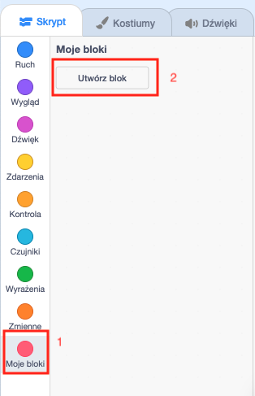

## Dodaj grafikę

W tej chwili duszek postaci po prostu mówi `tak! :)` lub `nie :(` na odpowiedzi gracza. Dodaj grafikę, aby poinformować gracza, czy odpowiedź jest poprawna, czy niepoprawna.

\--- task \---

Utwórz nowy duszek o nazwie „Wynik” i nadaj mu kostium „zaznaczony/sprawdzony” oraz „krzyżyk”.


\--- /task \---

\--- task \---

Zmień kod duszka postaci, aby zamiast mówić coś graczowi, `nadawał komunikat`{:class="block3events"} „dobrze” lub „źle”.


```blocks3
jeżeli <(odpowiedź) = ((liczba 1) * (liczba 2))> to
- powiedz [tak! :)] przez (2) sekund
+ nadaj komunikat (poprawnie v)
w przeciwnym razie
- powiedz [nie :(] przez (2) sekund
+ nadaj komunikat (niepoprawnie v)
koniec
```

\--- /task \---

\--- task \---

Teraz możesz użyć tych komunikatów do `pokazania`{:class="block3looks"} kostiumu „zaznaczony” lub „krzyżyk”. Dodaj następujący kod do duszka „Wynik”:


```blocks3
    kiedy otrzymam [dobrze v]
    zmień kostium na (zaznaczony v)
    pokaż
    czekaj (1) sekund
    ukryj

    kiedy otrzymam [źle v]
    zmień kostium na (krzyżyk v)
    pokaż
    czekaj (1) sekund
    ukryj

    kiedy zielona flaga kliknięta
    ukryj
```

\--- /task \---

\--- task \---

Ponownie przetestuj grę. Gdy odpowiesz poprawnie na pytanie, powinien się pokazaż „ptaszek” i „krzyżyk”, gdy odpowiesz źle!


\--- /task \---

Czy widzisz, że kod `kiedy otrzymam [dobrze]`{:class="block3events"} i `kiedy otrzymam [źle]`{:class="block3events"} jest prawie identyczny?

Utwórz własny blok, aby uprościć swój kod.

\--- task \---

Wybierz duszka "Wynik". Następnie kliknij `Moje bloki`{:class="block3myblocks"}, a następnie **Utwórz blok**. Utwórz nowy blok i nazwij go `animacja`{:class="block3myblocks"}.




\--- /task \---

\--- task \---

Przenieś kod, który `pokazuje`{:class="block3looks"} i `ukrywa`{:class="block3looks"} duszka „Wynik” do bloku `animacja`{:class="block3myblocks"}:


```blocks3
definiuj animacja
pokaż
czekaj (1) sekund
ukryj
```

\--- /task \---

\--- task \---

Upewnij się, że usunąłeś bloki `pokaż`{:class="block3looks"} i `ukryj`{:class="block3looks"} poniżej **obu** bloków `zmiany kostiumu`{:class="block3looks"}.

Następnie dodaj blok `animacja`{:class="block3myblocks"} poniżej obu bloków `zmiany kostiumu`{:class="block3looks"}. Twój kod powinien wyglądać teraz tak:


```blocks3
    
kiedy otrzymam [poprawnie v]
zmień kostium na (zaznaczony v)
animacja:: własna

kiedy otrzymam [niepoprawnie v]
zmień kostium na (krzyżyk v)
animacja:: własna
```

\--- /task \---

Dzięki niestandardowemu blokowi `animacja`{:class="block3myblocks} do zmiany czasu przez jaki wyświetlany będzie kostium duszka „Wynik” wystarczy tylko pojedyncza zmiany w kodzie.

\--- task \---

Zmień swój kod, tak aby wyświetlał kostiumy „zaznaczony” lub „krzyżyk” przez 2 sekundy.

\--- /task \---

\--- task \---

Zamiast `pokazywania`{:class="block3looks"} i `ukrywania`{:class="block3looks"} kostiumów „zaznacz” lub „krzyżyk”, możesz zmienić `animacji`{:class="block3myblocks"}, aby kostiumy znikały.


```blocks3
    definiuj animacja
    ustaw efekt [duch v] na (100)
    pokaż
    powtórz (25)
        zmień efekt [duch v] przez (-4)
    koniec
    ukryj
```

\--- /task \---

Czy jesteś w stanie poprawić animację grafiki „zaznaczony” lub „krzyżyk”? Spróbuj dodać kod, dzięki któremu kostiumy również zanikały, albo wypróbuj inne fajne efekty:

