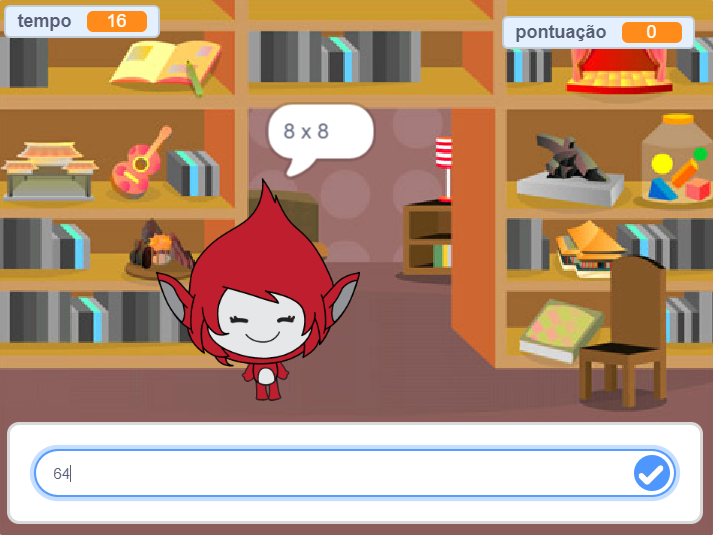

## Introdução

Neste projeto você vai aprender a criar um jogo de tabuada de multiplicar, no qual terá que conseguir responder ao numero máximo de questões corretas em 30 segundos.

  <iframe allowtransparency="true" width="485" height="402" src="https://scratch.mit.edu/projects/embed/42225768/?autostart=false" frameborder="0"></iframe>
  

### Informação adicional para líderes de clubes

Se precisar imprimir este projeto, por favor, use a [versão para impressão](https://projects.raspberrypi.org/en/projects/brain-game/print).

## \--- collapse \---

## title: Notas dos líderes dos clubes

## Introdução:

In this project, children will learn how to make a times table quiz game, in which the player has to answer as many questions correctly as they can in 30 seconds.

## Resources

For this project, Scratch 2 should be used. Scratch 2 can either be used online at [jumpto.cc/scratch-on](http://jumpto.cc/scratch-on) or can be downloaded from [jumpto.cc/scratch-off](http://jumpto.cc/scratch-off) and used offline.

You can find a completed version of this project [online](http://scratch.mit.edu/projects/42225768/#editor), or it can be downloaded by clicking the 'Project Materials' link for this project, which contains:

* BrainGame.sb2

## Learning Objectives

* This project consolidates learning of previous programming skills learnt, and shows how broadcasts can be used to create a simple game menu system.

This project covers elements from the following strands of the [Raspberry Pi Digital Making Curriculum](http://rpf.io/curriculum):

* [Combine programming constructs to solve a problem.](https://www.raspberrypi.org/curriculum/programming/builder)

## Challenges

* "Changing costumes" - changing how the game character looks in response to correct and incorrect answers;
* "Adding a score" - adding a point for every correct question answered;
* "Start screen" - changing the stage backdrop in response to the `start`{:class="blockevents"} and `end`{:class="blockevents"} broadcast messages, creating 2 game 'screens';
* "Improved animation" - using loops and effects to improve the correct/wrong graphics animation;
* "Sound and music" - consolidating learning of music loops and sound effects;
* "Race to 10 points" - changing the game logic to create a new game objective;
* "Instruction screen" - consolidating the use of broadcasts to create a game menu, by adding a new 'instructions' button and screen.

\--- /collapse \---

## \--- collapse \---

## title: Project materials

## Club leader resources

* [Downloadable completed Scratch 2 project](resources/BrainGame.sb2)
* [Online completed Scratch 2 project](http://scratch.mit.edu/projects/42225768/#editor)

\--- /collapse \---