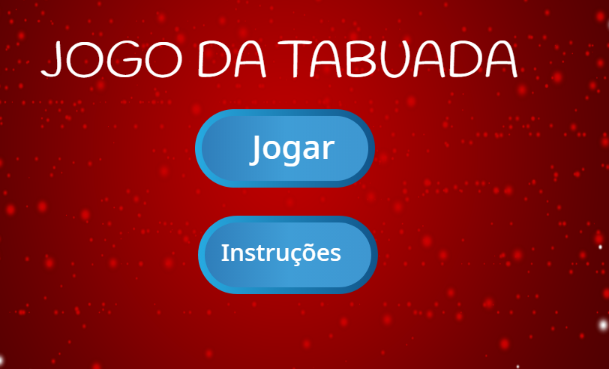

\--- challenge \---

## Desafio: Tela de instruções

Você pode adicionar uma tela de instruções ao seu jogo, para explicar ao seu jogador como jogar o jogo? Você vai precisar de um botão "Instruções" e outro plano de fundo.



Você também vai precisar de um botão "Voltar" para levá-lo ao menu principal.

```blocks
    transmissão [main menu v]
```

\--- /challenge \---