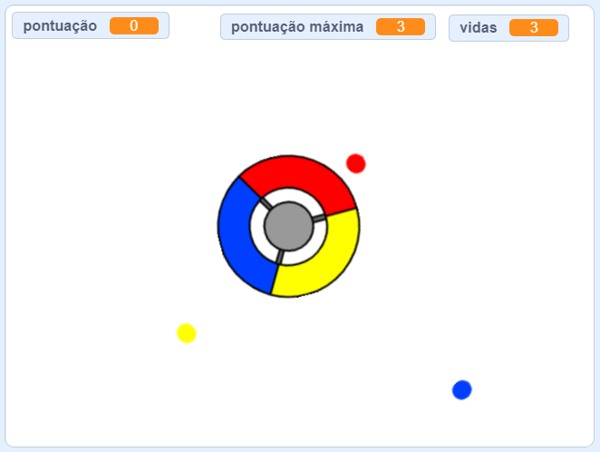

## E agora?

Experimente o projeto [Pega pontos](https://projects.raspberrypi.org/pt-BR/projects/catch-the-dots?utm_source=pathway&utm_medium=whatnext&utm_campaign=projects) para criar um jogo de reação! Nesse projeto, você aprenderá a fazer clones de atores e como usar uma variável para acelerar gradualmente o jogo.

--- no-print ---

Use as teclas de seta no seu teclado para girar a roda do controlador e pegar os pontos voadores conforme eles chegam ao centro. Se você perder três pontos, o jogo acaba.

  <iframe allowtransparency="true" width="485" height="402" src="https://scratch.mit.edu/projects/embed/252923761/?autostart=false" frameborder="0" scrolling="no"></iframe>
  

--- /no-print ---

--- print-only ---

--- /print-only ---

***
Este projeto foi traduzido por voluntários:

Pedro Lucas de Almeida Morgado

Artur Licks

Tiago Almeida

Laura Fuciarelli

Graças a voluntários, podemos dar às pessoas de todo o mundo a chance de aprender em seu próprio idioma. Você pode nos ajudar a alcançar mais pessoas oferecendo-se para traduzir - mais informações em rpf.io/translate.
