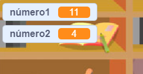

## Criação de perguntas

Vamos começar por criar perguntas aleatórias para o jogador responder.

+ Inicie um novo projeto do Scratch e exclua o sprite do gato para que seu projeto fique vazio. Você pode encontrar o editor online do Scratch em <a href="http://jumpto.cc/scratch-new" target="_blank"> jumpto.cc/scratch-new </a>.

+ Escolha um personagem um plano de fundo para o seu jogo. Você pode escolher qualquer coisa que gostar! Um exemplo:
    
    

+ Cria duas novas variáveis ​​chamadas `número 1` {:class="blockdata"} e `número 2` {: class = "blockdata"}. Estas variáveis vão ​​guardar os dois números que vão ser multiplicados.
    
    

+ Adicione o código ao seu personagem, para definir ambas as variáveis ​​para um número `aleatório` {:class="blockoperators"} entre 2 e 12.
    
    ```blocks
        quando alguém clicar na bandeira verde
            altera [número 1 v] para (um valor aleatório entre (2) e (12))
            altera [número 2 v] para (um valor aleatório entre (2) e (12))
    ```

+ Você pode então pedir ao jogador a resposta e dizer se estava certo ou errado.
    
    ```blocks
        quando alguém clicar na bandeira verde
            altera [numero 1 v] para (um valor aleatório entre (2) e (12))
            altera [numero 2 v] para (um valor aleatório entre (2) e (12))
            pergunta (a junção de (numero 1) com (a junção de [ x ] com (numero 2))) e espera pela resposta
            se <(resposta) = ((numero 1) * (numero 2))> então 
                diz [certo! :)] durante (2) s
            senão
                diz [errado:(] durante (2) s
            fim
    ```

+ Teste seu projeto completamente, respondendo uma questão corretamente e outra com a resposta errada.

+ Add a `forever`{:class="blockcontrol"} loop around this code, so that the player is asked lots of questions.

+ Create a countdown timer on the stage, using a variable called `time`{:class="blockdata"}. The 'Ghostbusters' project has instructions for making a timer (in step 5) if you need help!

+ Test your project again - you should be able to continue asking questions until the time runs out.