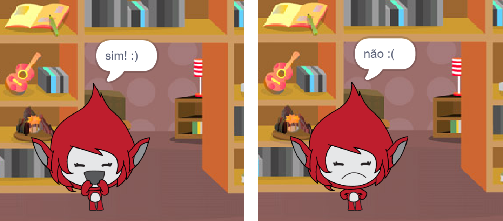

## Desafio: adicionar uma pontuação e reações

Você pode adicionar um placar ao seu jogo?

Você pode adicionar código para que o jogador marque um ponto para cada resposta correta. Se você estiver se sentindo maluco, você também poderia adicionar código para redefinir a pontuação do jogador para zero se ele der uma resposta errada!

[[[generic-scratch3-high-score]]]

Você pode fazer seu personagem reagir à resposta do jogador mudando para uma fantasia diferente se a resposta estiver correta ou incorreta?

