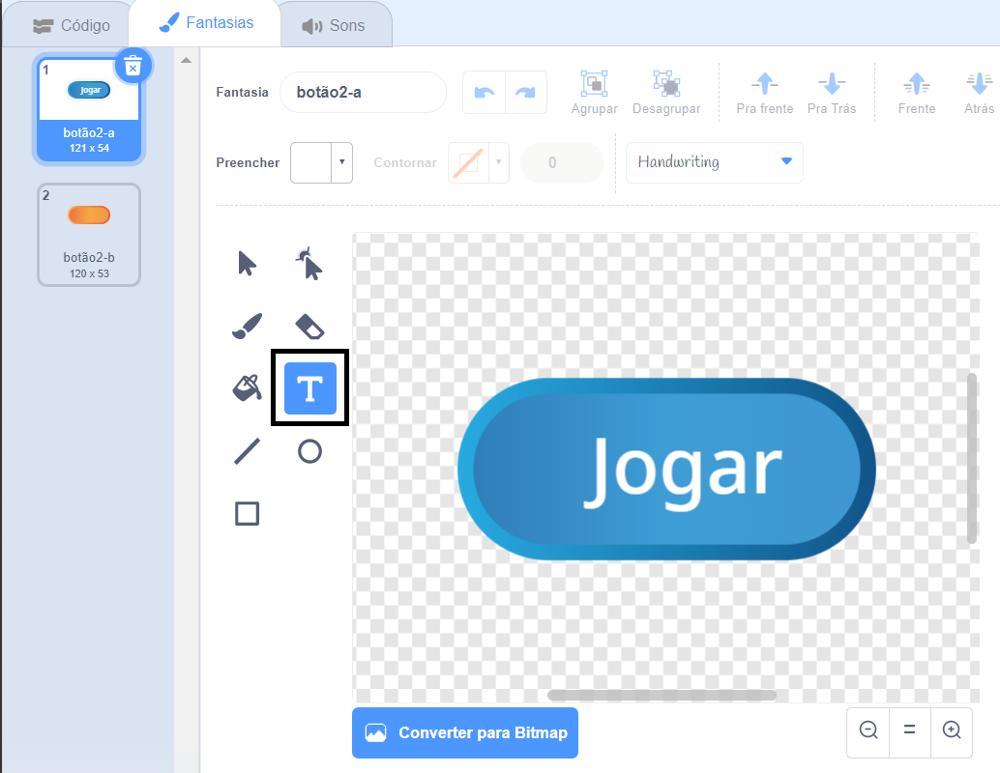

## Vários jogos

Vamos inserir um botão de ‘Jogar’ ao seu jogo, para que possa jogar várias vezes.

+ Cria um novo objeto com um botão de ‘Jogar’, no qual o jogador irá clicar para iniciar um novo jogo. Você mesmo pode desenhar ou editar um ator da biblioteca do Scratch.
    
    

+ Adicione este código ao seu novo botão.
    
    ```blocks
        quando alguém clicar na bandeira verde
           mostre
           Quando alguém clicar no objeto
           esconde
           transmita a mensagem [começar v]
    ```
    
    Este código mostra um botão Jogar quando seu projeto é iniciado. Quando o botão é clicado se escode e então uma mensagem é transmitida que o jogo irá iniciar.

+ Você precisará editar o código do seu personagem, para que o jogo comece quando eles receberem o `início`{:class="blockevents"}, e não quando a bandeira é clicada.
    
    Substitua o código de`quando a bandeira for clicada`{:class="blockevents"} por `quando iniciar`{:class="blockevents"}.
    
    

+ Clique na bandeira verde e então clique no seu novo botão Jogar para testá-lo. Você verá que o jogo não inicia mesmo quando o botão é clicado.

+ Você notou que o contador de tempo inicia quando a bandeira verde é clicada, e não quando o jogo começa?
    
    
    
    Consegue resolver este problema?

+ Clique no palo, e substitua o bloco `para tudo`{:class="blockcontrol"} por uma mensagem `fim`{:class="blockevents"}.
    
    

+ Você agora pode adicionar código ao seu botão, para mostrá-lo denovo ao fim de cada partida.
    
    ```blocks
        quando eu receber [fim v]
      mostrar
    ```

+ Você também precisa impedir que o personagem faça novas questões ao final do jogo:
    
    ```blocks
        quando recebo [fim v]
      pare [outros scripts no objeto v]
    ```

+ Teste seu botão jogar apenas jogando algumas partidas. Você pode observar que o botão Jogar aparece após cada partida. Para tornar o teste mais fácil, você pode encurtar cada partida, de modo que dure apenas alguns segundos.
    
    ```blocks
        alterar[tempo v] para [10]
    ```

+ Você até pode mudar a aparência do botão quando o mouse passar por cima.
    
    ```blocks
        quando a bandeira verde for clicada
      mostrar
      para sempre
      se <touching [mouse-pointer v]?> então
        altere efeito [olho de peixe v] para (30)
      senão
         altere o efeito [olho de peixe v] para (0)
      fim
      fim
    ```
    
    