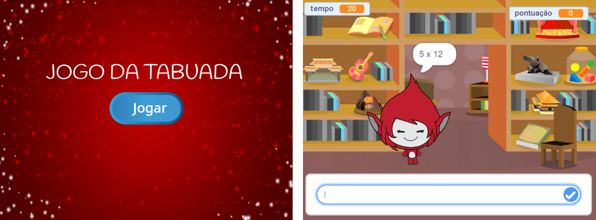

\--- challenge \---

## Desafio: Tela inicial

Você pode adicionar outro pano de fundo para seu palco, que passará a ser a tela de início do jogo? Você pode usar os blocos `quando eu receber o início`{:classe="blockevents"} e `quando recebo final`{:classe="blockevents"} para alternar entre cenários.

Você pode também mostrar e esconder seu personagem, e até mesmo mostrar e esconder o contador utilizando esses blocos:

```blocks
mostrar variável [tempo v]
```

```blocks
esconder variável [tempo v]
```



\--- /challenge \---