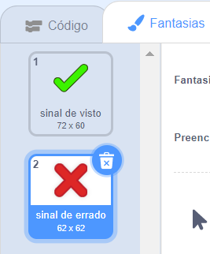
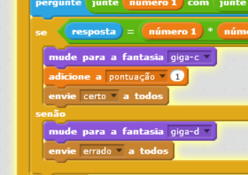
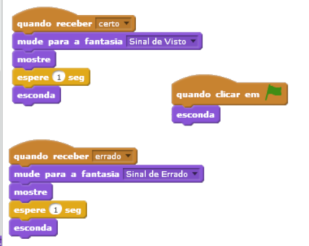
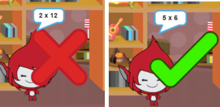
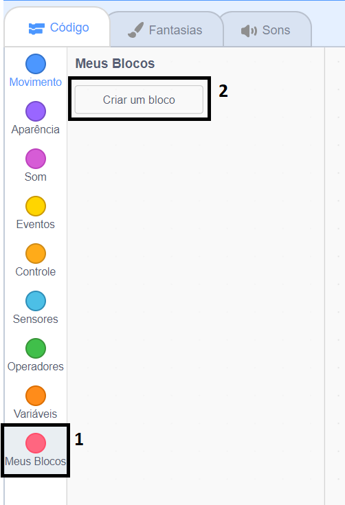
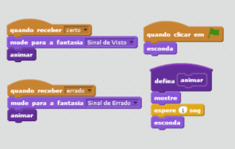

## Adicionando gráficos

Ao invés do personagem somente dizer `sim! :)` ou `não :(` para o jogador, vamos adicionar alguns gráficos para que ajudem o jogador a entender como está indo.

+ Crie um novo objeto chamado 'Resultado', contendo ambos um 'sinal de visto' e um 'sinal de errado'.
    
    

+ Mude o código de seu personagem, para que ao invés de dizer ao jogador o resultado, mostrar as mensagens `correto`{:class="blockevents"} e `errado`{:class="blockevents"}.
    
    

+ Você pode aogra usar essas mensagens para mostar o 'sinal de confere' ou 'sinal de errado'. Adicione esse código ao seu novo objeto 'Resultado':
    
    

+ Teste seu jogo novamente. Você deve ver um 'sinal de visto' sempre que responder uma questão corretamente, e um 'sinal de errado' sempre que responder errado!
    
    

+ Você notou que o código para `quando eu recebo correto`{:class="blockevents"} e `quando eu recebo errado`{:class="blockevents"} são quase idênticos? Vamos criar uma função para facilitar as alterações no código.
    
    No seu objeto 'Resultado', clique em `Mais Blocos`{:class="blockmoreblocks"}, e então 'Criar um Bloco'. Crie uma nova função chamada `animar`{:class="blockmoreblocks"}.
    
    

+ Você pode então adicionar o códico de animação em sua nova função de animação, e então usar a função duas vezes:
    
    

+ Now, if you want to show the tick and the cross for a longer or shorter time, you only need to make one change to your code. Try it!

+ Instead of just showing and hiding the tick and the cross, you could change your animation function, so that the graphics fade in.
    
    ```blocks
        define [animate]
        set [ghost v] effect to (100)
        show
        repeat (25)
            change [ghost v] effect by (-4)
        end
        hide
    ```