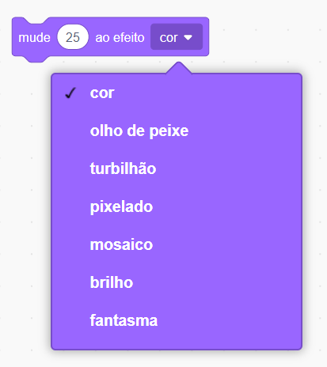

\--- challenge \---

## Desafio: Melhorar a animação

Você pode melhorar a animação dos seus gráficos? Você pode programar o "sinal de visto" e o "sinal de errado" para que eles desapareçam instantaneamente ou também aos poucos. Ou você pode usar outros efeitos legais:

\--- /challenge \---