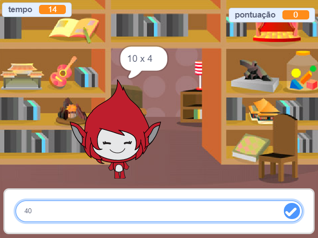

## Introdução

Neste projeto vais aprender a criar um jogo de perguntas sobre a tabuada de multiplicar, no qual terás que conseguir responder ao numero máximo de perguntas corretas em 30 segundos.

  <iframe allowtransparency="true" width="485" height="402" src="https://scratch.mit.edu/projects/embed/42225768/?autostart=false" frameborder="0"></iframe>
  

### Informações adicionais para os líderes do clube

Se você precisar imprimir este projeto, por favor, use a [versão para impressão](https://projects.raspberrypi.org/en/projects/brain-game/print).

## \--- collapse \---

## title: Notas de líder do clube

## Introdução:

Neste projeto, as crianças aprenderão como fazer um jogo de teste da tabela de multiplicação, no qual o jogador tem que responder o máximo possível de perguntas corretamente em 30 segundos.

## Recursos

Para este projeto, deve ser usado o Scratch 2. O Scratch 2 pode ser usado online em [ jumpto.cc/scratch-on ](http://jumpto.cc/scratch-on) ou pode ser descarregado de [ jumpto.cc/scratch-off ](http://jumpto.cc/scratch-off) e usado offline.

Você pode encontrar uma versão completa deste projeto [ online ](http://scratch.mit.edu/projects/42225768/#editor), ou pode ser descarregado clicando no link 'Materiais do Projeto' para este projeto, que contém:

* BrainGame.sb2

## Objetivos de Aprendizagem

* Este projeto consolida anteriores aprendizagens de linguagens de programação e mostra como as transmissões de mensagens podem ser usadas para criar um sistema simples de jogos com menu.

Este projeto abrange elementos das seguintes vertentes do [ Curriculo Raspberry Pi Digital Making ](http://rpf.io/curriculum):

* [Combine construções de programação para resolver um problema.](https://www.raspberrypi.org/curriculum/programming/builder)

## Desafios

* "Mudança de trajes" - mudando a aparência da personagem do jogo em resposta às respostas corretas e incorretas;
* "Adicionando uma pontuação" - adicionando um ponto para cada pergunta correta respondida;
* "Tela inicial" - alterar o pano de fundo de palco em resposta a `começar` {: classe = "blockevents"} e `acabar` {: classe = "blockevents"} transmitir mensagens, criando 2 'telas' para o jogo;
* "Melhorar a animação" - usando loops e efeitos para melhorar a animação gráfica correto/errado;
* "Som e música" - consolidando a aprendizagem de loops de música e efeitos sonoros;
* "Corrida de 10 pontos" - mudar a lógica do jogo para criar um novo objectivo de jogo;
* "Tela de instruções" - consolidando o uso de transmissão de mensagens para criar um menu do jogo, adicionando um novo botão e tela de "instruções".

\--- /collapse \---

## \--- collapse \---

## title: Materiais do projeto

## Recursos do líder de clube

* [Projeto de Scratch 2 completo para download](resources/BrainGame.sb2)
* [Projeto de Scratch 2 completado on-line](http://scratch.mit.edu/projects/42225768/#editor)

\--- /collapse \---