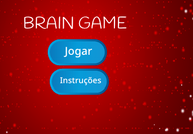

## Desafio: ecrã de instruções

Podes adicionar um ecrā de instruções ao teu jogo, dizendo ao seu jogador como jogar o jogo? Vais precisar de um botão "Instruções" e outro cenário para o teu palco.



Podes também precisar adicionar um botão "Voltar" para permitir que o jogador volte para o ecrā inicial.

```blocks3
    difunde a mensagem (tela inicial v)
```