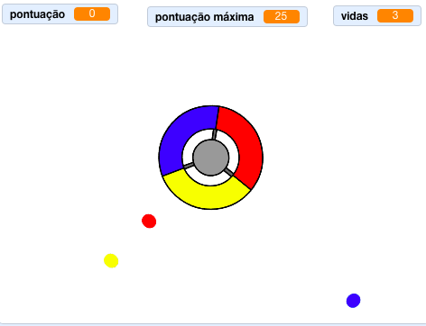

## O que se segue?

Experimenta o projeto [Apanha os pontos](https://projects.raspberrypi.org/pt-PT/projects/catch-the-dots?utm_source=pathway&utm_medium=whatnext&utm_campaign=projects) para criar um jogo de reação! Nesse projeto, vais aprender a fazer clones de actores e a usar uma variável para acelerar gradualmente o jogo.

--- no-print --- Usa as setas do teclado para girar a roda controladora e pega os pontos voadores quando eles chegarem ao centro. Se perderes três pontos, o jogo acaba.

  <iframe allowtransparency="true" width="485" height="402" src="https://scratch.mit.edu/projects/embed/252923761/?autostart=false" frameborder="0" scrolling="no"></iframe>
  

--- /no-print ---

--- print-only ---  --- /print-only ---

**Tradução Contribuída pela Comunidade**

Este projeto foi traduzido por **Paulo Ribeiro dos Santos** e revisto por **Homero Cardoso**

Nossos incríveis voluntários de tradução nos ajudam a dar às crianças em todo o mundo a oportunidade de aprender a programar. Pode nos ajudar a chegar a mais crianças traduzindo nossos projetos - leia mais em [rpf.io/translate](https://rpf.io/translate).