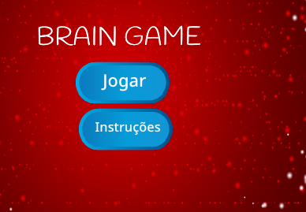

\--- challenge \---

## Desafio: Ecrã de instruções

Podes adicionar uma tela de instruções ao seu jogo, dizendo ao seu jogador como jogar o jogo? Vais precisar de um botão "Instruções" e outro pano de fundo para o teu palco.



Podes precisar também um botão "Voltar" para retornar ao menu principal.

```blocks
    difunde a mensagem [main menu v]
```

\--- /challenge \---