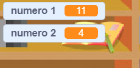

## Criação de perguntas

Vamos começar criando perguntas aleatórias para o jogador responder.

+ Cria um novo projeto no Scratch, e apaga o objeto gato de maneira a que o projeto fique totalmente vazio. Podes encontrar o editor online do Scratch em <a href="http://jumpto.cc/scratch-new" target="_blank"> jumpto.cc/scratch-new </a>.

+ Escolhe uma personagem e um fundo para o teu jogo. Podes escolher a que mais gostares! Exemplo:
    
    

+ Cria 2 novas variáveis ​​chamadas ` numero 1 ` {: class = "blockdata"} e ` número 2 ` {: class = "blockdata"}. Estas variáveis ​​guardarão os 2 números que vão ser multiplicados.
    
    

+ Adiciona o código à tua personagem, para fixar ambas as variáveis ​​em ` um valor ao acaso entre ` {: class = "blockoperators"} 2 e 12.
    
    ```blocks
        quando alguém clicar na bandeira
      altera [número 1] para (um valor ao acaso entre (2) e (12)) 
      altera [número 2] para (um valor ao acaso entre (2) e (12))
    ```

+ Podes então pedir ao jogador a resposta e dizer-lhe se està certo ou errado.
    
    ```blocks
        quando alguém clicar na bandeira
         altera [número 1] para (um valor ao acaso entre (2) e (12)) 
         altera [número 2] para (um valor ao acaso entre (2) e (12))
         pergunta (a junção de (número 1) com a junção de [ x ] com (número 2)) e espera pela resposta
    se <( a resposta) = ((número 1)*(número 2))> , então 
            Difunde a mensagem [correto! :)] durante (2) segundos 
    senão 
              difunde a mensagem [errado :(] durante (2)
    terminar
    ```

+ Experimenta o teu projeto duas vezes, na primeira escrevendo uma resposta correta e depois uma resposta incorreta.

+ Adicione um loop ` repete para sempre ` {: class = "blockcontrol"} em torno deste código, de modo que o jogador é questionado com muitas perguntas.

+ Cria um cronometro de conta decrescente no cenário, utilizando uma variável que se chame ` tempo ` {: class = "blockdata"}. O projeto 'Ghostbusters' tem instruções para fazer um temporizador (no passo 5) se você precisar de ajuda!

+ Experimenta novamente o teu projeto. Deveras de poder continuar a fazer perguntas até que o tempo acabe.