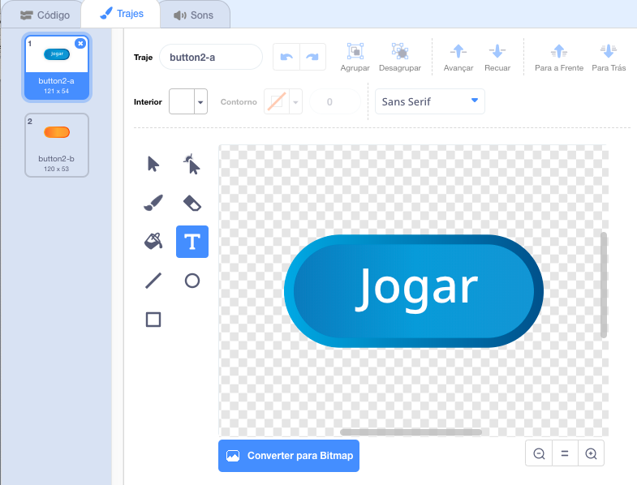
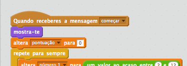
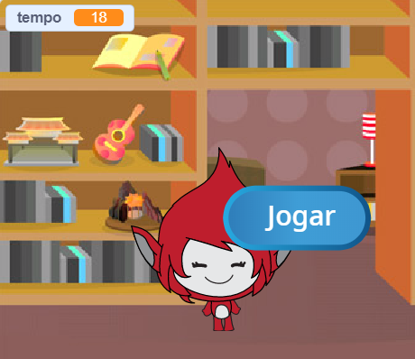
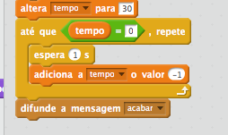
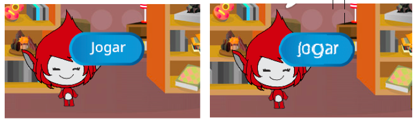

## Jogadas múltiplas

Vamos inserir um botão de ‘Jogar’ ao teu jogo, para que possas jogar múltiplas vezes.

+ Cria um novo objeto com um botão de ‘Jogar’, no qual o jogador irá clicar para iniciar um novo jogo. Podes desenha-lho tu mesmo ou editar um actor da biblioteca do Scratch.
    
    

+ Adiciona este código ao teu botão novo:
    
    ```blocks
        Quando alguém clicar na bandeira verde
           mostra-te
    
           Quando alguém clicar em ti
           esconde-te
           difunde a mensagem [começar v]
    ```
    
    Este código mostra o botão de jogar quando o projeto começa. Ao clicar no botão, este esconde-se e envia uma mensagem para que o jogo comece.

+ Precisas de editar o código da tua personagem para que o jogo comece quando receber a mensagem de `começar` {: classe = "blockevents"}, e não quando a bandeira é clicada.
    
    Substitui o código `quando alguém clicar na bandeira verde` {: classe = "blockevents"} com `quando receberes a mensagem começar ` {: classe = "blockevents"}.
    
    

+ Faz clique na bandeira verde e depois pressiona o teu novo botão de jogo para o experimentares. O jogo só deve de começar depois de clicares no botão.

+ Reparas-te que o cronómetro começa a contagem quando fazes clique na bandeira verde, e não quando começas o jogo?
    
    
    
    Podes resolver este problema?

+ Faz clique no cenário, e substitui o bloco ` pára tudo` Bloco {: class = "blockcontrol"} e difunde a mensagem ` acabar` {: class = "blockevents"}.
    
    

+ Agora podes adicionar código ao teu botão, para mostrá-lo novamente no final de cada jogo.
    
    ```blocks
        Quando receberes a mensagem [acabar v]
        mostra-te
    ```

+ Também terás de fazer com que a tua personagem deixe de fazer perguntas no fim de cada jogo:
    
    ```blocks
        Quando receberes a mensagem [acabar v]
        pára [os teus outros guiões v]
    ```

+ Testa o botão jogando varias vezes. Deverás ver aparecer o botão de jogar depois de cada jogo. Para tornar o teste mais fácil, podes encurtar o jogo, de maneira a durar apenas alguns segundos.
    
    ```blocks
        altera [tempo v] para [10]
    ```

+ Podes também fazer a forma do botão mudar quando lhe aproximas o rato.
    
    ```blocks
        Quando alguém clicar na bandeira verde
        mostra-te
        repete para sempre 
        se <touching [mouse-pointer v]?>, então 
            altera o teu efeito [olho de peixe v] para (30)
        senão
            altera o teu efeito [olho de peixe v] para (0)
      end
    end
    ```
    
    