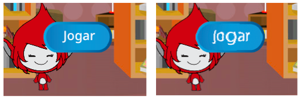

## Jogadas múltiplas

Vamos inserir um botão de ‘Jogar’ ao teu jogo, para que possas jogar muitas vezes.

+ Cria um novo objeto com um botão de ‘Jogar’, no qual o jogador irá clicar para iniciar um novo jogo. Podes desenha-lho tu mesmo ou editar um sprite da biblioteca Scratch.
    
    

+ Adiciona este código ao teu botão novo.
    
    ```blocks
        Quando alguém clicar na bandeira
        mostra-te
    
        Quando alguém clicar em ti
        esconde-te
        difunde a mensagem começar
    ```
    
    Este código mostra o botão de jogar quando o projeto começa. Ao clicar no botão, ele esconde-se e envia uma mensagem para que o jogo comece.

+ Precisas de editar o código da tua personagem para que o jogo comece quando receber a mensagem de `começar` {: classe = "blockevents"}, e não quando a bandeira é clicada.
    
    Substituir o código `quando clicado bandeira` {: classe = "blockevents"} com `quando eu receber mensagem de começar ` {: classe = "blockevents"}.
    
    

+ Faz clique na bandeira verde e depois pressiona o teu novo botão de jogo para o experimentares. O jogo só deve de começar ao fazeres clique em cima do botão.

+ Reparas-te que o cronómetro começa a contagem quando fazes clique na bandeira verde, e não quando começas o jogo?
    
    
    
    Podes solucionar este problema?

+ Click on the stage, and replace the `stop all`{:class="blockcontrol"} block with an `end`{:class="blockevents"} message.
    
    

+ You can now add code to your button, to show it again at the end of each game.
    
    ```blocks
        when I receive [end v]
        show
    ```

+ You'll also need to stop your character asking questions at the end of each game:
    
    ```blocks
        when I receive [end v]
        stop [other scripts in sprite v]
    ```

+ Test your play button by playing a couple of games. You should notice that the play button shows after each game. To make testing easier, you can shorten each game, so that it only lasts a few seconds.
    
    ```blocks
        set [time v] to [10]
    ```

+ You can even change how the button looks when the mouse hovers over it.
    
    ```blocks
        when flag clicked
        show
        forever
        if <touching [mouse-pointer v]?> then
            set [fisheye v] effect to (30)
        else
            set [fisheye v] effect to (0)
        end
        end
    ```
    
    