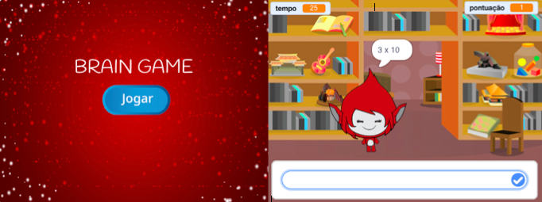

\--- challenge \---

## Desafio: Ecrã de inicio

Consegues inserir outro fundo ao teu cenário, para que se converta no ecrã de inicio do jogo? Podes usar os blocos ` Quando receberes a mensagem começar ` {: class = "blockevents"} e ` Quando receberes a mensagem acabar ` {: class = "blockevents"} para alternar entre os cenários.

Também podes mostrar e ocultar o teu personagem e até mesmo mostrar e ocultar o teu temporizador usando estes blocos:

```blocks
mostra a variável [tempo v]
```

```blocks
esconde a variável [tempo v]
```



\--- /challenge \---