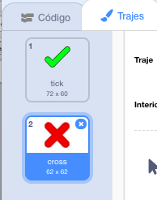
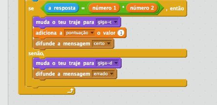
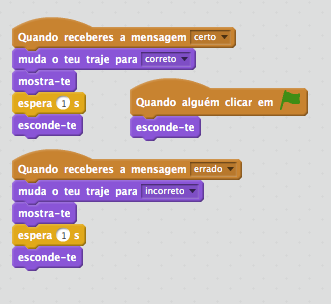
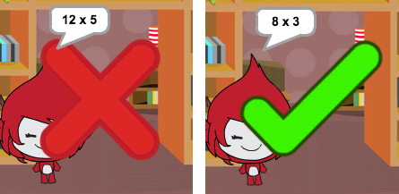
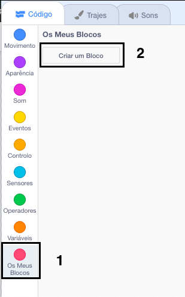
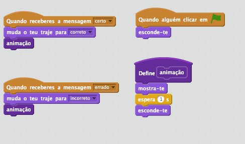

## Inserir ícones

Em vez de a tua personagem apenas dizer ` certo! :) ` ou ` errado! :(` ao jogador, vamos inserir alguns ícones para que ajudem o jogador a saber como lhe está a correr.

+ Cria um novo actor com o nome ‘resultado’, que contenha os trajes de ‘correcto’ e ‘incorrecto’.
    
    

+ Muda o código do teu personagem, para que em vez de dizer o resultado ao jogador ao jogador difunda mensagens ` certo ` {: class = "blockevents"} e ` errado ` {: class = "blockevents"}.
    
    

+ Agora, podes usar estas mensagens para mostrar os trajes 'correcto' ou 'incorrecto'. Adiciona este código ao teu novo actor 'Resultado':
    
    

+ Testa o teu jogo novamente. Deverás ver um "certo" sempre que tiveres uma pergunta correta e uma cruz sempre que estiveres errado!
    
    

+ Notaste que o código para ` quando eu recebo a resposta correta? ` {: class = "blockevents"} e ` quando eu recebo a resposta errada ` {: class = "blockevents"} é quase idêntico? Vamos criar uma função para facilitar a alteração do teu código.
    
    No teu actor 'Resultado', clica em ` Mais Blocos ` {: class = "blockmoreblocks"} e, em seguida, "Criar um Bloco". Crie uma nova função chamada ` animação ` {: class = "blockmoreblocks"}.
    
    

+ Podes adicionar o código da animação na tua nova função de animação, e depois usa a função duas vezes:
    
    

+ Now, if you want to show the tick and the cross for a longer or shorter time, you only need to make one change to your code. Try it!

+ Instead of just showing and hiding the tick and the cross, you could change your animation function, so that the graphics fade in.
    
    ```blocks
        define (animação)
    altera o teu efeito [fantasma v] para (100)
    mostra-te
    repete (25) vezes 
      adiciona ao teu efeito [fantasma v] o valor (-4)
    end
    esconde-te
    ```