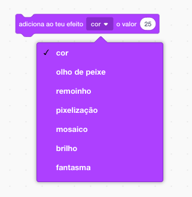

## Adicionar gráficos

De momento, o actor do personagem só diz `certo! :)` ou `errado :(` às respostas do jogador. Adiciona alguns gráficos para informar o jogador se sua resposta está correta ou incorreta.

--- task ---

Cria um novo actor com o nome ‘resultado’, com trajes de ‘correcto’ e ‘incorrecto’.


--- /task ---

--- task ---

Altera o código do teu actor personagem para que, em vez de dizer algo ao jogador, ele `difunda a mensagem`{:class="block3events"} 'certo' ou 'errado'.


```blocks3
if <(answer) = ((number 1)*(number 2))> then

- say [yes! :)] for (2) seconds
+ broadcast (correct v)
else
- say [nope :(] for (2) seconds
+ broadcast (wrong v)
end
```

--- /task ---

--- task ---

Agora podes usar estas mensagens para `mostrar`{:class="block3look"} o traje 'correto' ou 'incorrecto'. Adiciona o seguinte código ao actor 'resultado':


```blocks3
    when I receive [correct v]
switch costume to (tick v)
show
wait (1) seconds
hide

when I receive [wrong v]
switch costume to (cross v)
show
wait (1) seconds
hide

when flag clicked
hide
```

--- /task ---

--- task --- Testa o teu jogo novamente. Deves ver o 'certo' sempre que responderes uma pergunta corretamente e o 'errado' sempre que responderes incorretamente!


--- /task ---

Notaste que o código para `quando receberes a mensagem certo`{:class="block3events"} e `quando receberes a mensagem a errado`{:class="block3events"} é quase idêntico?

Então para poderes alterar o teu código mais facilmente, vais criar um bloco personalizado.

--- task ---

Seleciona o actor 'Resultado'. Depois clica em `Meus Blocos`{:class="block3myblocks"}, e depois em **Criar um Bloco**. Cria um bloco novo e chama-lhe `animar`{:class="block3myblocks"}.


--- /task ---

--- task --- Move the code to `show`{:class="block3looks"} and `hide`{:class="block3looks"} the 'Result' sprite into the `animate`{:class="block3myblocks"} block:


```blocks3
define animate
show
wait (1) seconds
hide
```

--- /task ---

--- task --- Certifica-te de que removeste os blocos `mostra-te`{:class="block3looks"} e `esconde-te`{:class="block3looks"} debaixo de **ambos** os blocos `muda o teu traje`{:class="block3looks"}.

Em seguida adiciona o bloco `animar`{:class="block3myblocks"} abaixo dos blocos `muda o teu traje`{:class="block3looks"}. O teu código agora deve estar parecido com isto:


```blocks3
    when I receive [correct v]
switch costume to (tick v)
animate:: custom

when I receive [wrong v]
switch costume to (cross v)
animate:: custom
```

--- /task ---

Por causa do bloco personalizado `animar`{:class="block3myblocks"}, agora só precisas de fazer uma mudança ao teu código se quiseres mostrar os trajes do actor 'Resultado' um tempo maior ou menor.

--- task ---

Altera o teu código para que o 'correto' ou 'incorreto' sejam mostrados por 2 segundos.

--- /task ---

--- task --- Em vez de `mostrar`{:class="block3looks"} e `esconder`{:class="block3looks"} os trajes 'correto' ou 'incorreto', podes mudar o teu bloco `animar`{:class="block3myblocks"} para que os trajes apareçam gradualmente.


```blocks3
    define animate
set [ghost v] effect to (100)
show
repeat (25)
change [ghost v] effect by (-4)
end
hide
```

--- /task ---

Podes melhorar a animação dos gráficos 'certo' e 'errado'? Podes adicionar código para também fazer os trajes desaparecerem gradualmente, ou podes usar outros efeitos interessantes:

