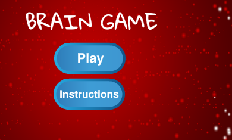

## Provocare: ecran de instrucțiuni

Puteți adăuga un ecran de instrucțiuni care îi spune jucătorului cum să joace jocul? Pentru aceasta, aveți nevoie de un buton "Instrucțiuni" și de un alt fundal pentru scenă.



De asemenea, este posibil să fie necesar să adăugați un buton "Înapoi" care să permită jucătorului să revină la ecranul de pornire.

```blocks3
    difuzat (ecranul de pornire v)
```