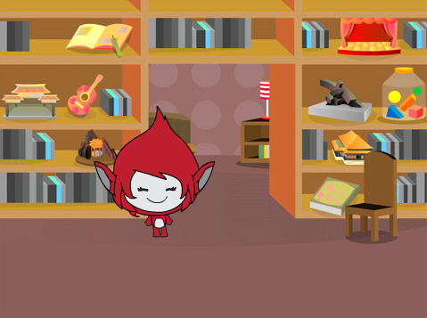

## Creează întrebări

Vei începe prin a crea întrebări aleatorii la care jucătorul trebuie să răspundă.

\--- task \---

Deschide un nou proiect Scratch.

**Online:** deschide un nou proiect Scratch la [rpf.io/scratch-new](http://rpf.io/scratch-new){:target="_blank"}.

**Offline:** deschide un nou proiect în editorul offline.

Dacă trebuie să descărci și să instalezi editorul offline Scratch, îl poți găsi la [rpf.io/scratchoff](http://rpf.io/scratchoff){: target = "_ blank"}.

\--- /task \---

\--- task \--- Adaugă un personaj și un decor pentru jocul tău. Poți alege orice dorești! Iată un exemplu:



\--- /task \---

\--- task \--- Asigură-te că ai selectat personajul tău. Creează două variabile noi, numite `numărul 1`{: class = "block3variables"} și `numărul 2`{: class = "block3variables"}}, pentru a stoca numerele pentru întrebările testului.

 

[[[generic-scratch3-add-variable]]]

\--- /task \---

\--- task \--- Adaugă coduri pentru personajul tău pentru a seta ambele `variabile`{: class = "block3variables"} la un număr `aleatoriu`{: class = "block3operators"} între 2 și 12.


```blocks3
când se dă clic pe steagul verde
setează [numărul 1 v] pentru a (alege aleatoriu (2) până la (12))
setează [numărul 2 v] pentru a (alege aleatoriu (2) până la (12))
```

\--- /task \---

\--- task \--- Adaugă cod la `întreb`{: class = "block3sensing"} player-ul pentru răspuns, și apoi `spun timp de 2 secunde`{: class = "block3looks"} dacă răspunsul a fost corect sau greșit:


```blocks3
când se dă click pe pictograma steag
setează [numărul 1 v] pentru a (alege aleatoriu (2) până la (12))
setează [numărul 2 v] pentru a (alege aleatoriu (2) până la (12))

+ cere (adaugă (numărul 1) (adaugă [x] (numărul 2))) și așteaptă 
+ dacă <(răspuns) = ((numărul 1) * (numărul 2))> apoi
+ spune [da! :)] pentru (2) secunde
+ altceva
+ spune [no :(] pentru (2) secunde
+ sfârșit
```

\--- /task \---

\--- task \---

Testează-ți proiectul de două ori: răspunde corect la o întrebare și incorect la cealaltă.

\--- /task \---

\--- task \---

Setează ` pentru totdeauna ` {: class = "block3control"} pe acest cod, astfel încât jocul să pună jucătorului o mulțime de întrebări la rând.

\--- hints \--- \--- hint \---

Trebuie să adaugi un bloc `pentru totdeauna`{: class = "block3control"} și să pui tot codul, cu excepția blocului `când se dă click pe pictograma steag`{: class = "block3control"}.

\--- / hint \--- \--- hint \--- Aici este blocul de care ai nevoie:

```blocks3
pentru totdeauna
sfârșit
```

\--- /hint \--- \--- hint \--- Așa ar trebui să arate codul: 

```blocks3
când se dă click pe pictograma steag

setează [numărul 1 v] pentru a (alege aleatoriu (2) până la (12))
setează [numărul 2 v] pentru a (alege aleatoriu (2) până la (12))
+ intreabă (adaugă (numărul 1) (adaugă [x] (numărul 2))) și așteaptă 
+ dacă <(răspuns) = ((numărul 1) * (numărul 2))> apoi
+ spune [da! :)] pentru (2) secunde
    altceva
        spune [no :(] pentru (2) secunde
    sfârșit
sfârșit
```

\--- /hint \--- \--- /hints \---

\--- /task \---