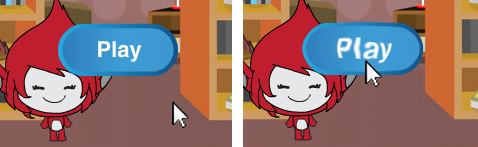

## Jocuri multiple

Acum, vei adăuga un buton "Play", astfel încât jucătorul să poată juca jocul tău de mai multe ori.

\--- task \--- Creează un nou buton "Play" pe care jucătorul trebuie să dea click pentru a porni un joc nou.

Poți desena personajul singur sau poți edita un personaj din bibliotecă.


\--- /task \---

\--- task \--- Adaugă acest cod la butonul personajului tău:


```blocks3
    când dăm click pe steagul verde
    arată

    când dăm click pe personaj 
    ascunde
    difuzează (începe v)
```

\--- /task \---

Noul cod include un alt bloc `broadcast`{: class = "block3events"}, care trimite mesajul "start".

Noul cod face ca butonul "Play" să fie afișat atunci când un jucător dă clic pe steagul verde. Când jucătorul dă clic pe butonul personajului, personajul se ascunde și transmite apoi un mesaj la care pot reacționa alte personaje.

În acest moment, personajul începe să pună întrebări imediat ce jucătorul dă clic pe steagul verde. Schimbă codul jocului astfel încât personajul să înceapă să pună întrebări atunci când primește mesajul "start" `broadcast`{: class = "block3events"}.

\--- task \--- Selectează personajul tău și, în secțiunea sa de cod, înlocuiește blocul `cand se dă click pe`{: class = "block3events"} cu blocul `atunci când primesc startul`{: class = "block3events"}.


```blocks3
<br />- atunci când dau click pe steagul verde
+ când primesc [start v]
setează [number 1 v] la (alegeți aleatoriu de la (2) la (12))
setează [numărul 2 v] la (alegeți aleatoriu de la (2) la (12))
cere (adaugă (numărul 1)(adaugă [x] (numărul 2))) și așteaptă
dacă <(răspuns) = ((numărul 1) * (numărul 2))> apoi
    spun [da! :)] pentru (2) secunde
altceva
    spune [nu :(] pentru (2) secunde
sfarsit
```

\--- /task \---

\--- task \---

Dă click pe steagul verde, apoi dă click pe noul buton "Redare" pentru a testa dacă funcționează. Ar trebui să vezi că jocul nu începe înainte de a da click pe buton.

\--- /task \---

Puteți vedea că cronometrul începe când se face clic pe steagul verde, în loc de când începe jocul?


\--- task \---

Puteți schimba codul pentru cronometru astfel încât să înceapă cronometrul când player-ul face clic pe buton?

\--- /task \---

\--- task \--- Adăugați codul la butonul dvs. sprite, astfel încât butonul să apară din nou la sfârșitul fiecărui joc.


```blocks3
    când primesc [sfârșitul v]
    arată
```

\--- /task \---

\--- task \---

Testați butonul "Redare" jucând câteva jocuri. Butonul ar trebui să apară la sfârșitul fiecărui joc.

Pentru a testa jocul mai repede, puteți modifica valoarea `timp`{: class = "block3variables"} astfel încât fiecare joc să dureze doar câteva secunde.


```blocks3
    setați ora [v] la [10]
```

\--- /task \---

\--- task \--- Puteți schimba modul în care arată butonul când indicatorul mouse-ului se află peste el.


```blocks3
    când pavilionul apăsat
    arată
    pentru totdeauna
    dacă <touching (mouse-pointer v)?> apoi
        setați [fishheye v] effect to (30)
    altceva
        set [efect fisheye v] efect la (0)
    sfârșitul

```

 \--- /task \---