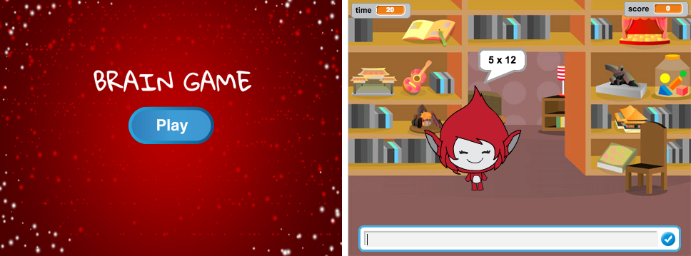

## Provocare: creați un ecran de pornire

Puteți adăuga un alt fundal care va fi ecranul de pornire pentru jocul dvs.?

Poți folosi `atunci când primesc startul`{: class = "block3events"} și `când primesc blocuri de capăt`{: class = "block3events"} pentru a comuta între fundaluri.

Pentru a afișa sau a ascunde caracterul atunci când jocul comută între fundalurile, puteți utiliza `show -`{: class = "block3looks"} și `ascunde`{: class = "block3looks"} blocuri.

Pentru a afișa sau a ascunde cronometrul și scorul atunci când jocul trece între fundaluri, puteți utiliza `afișezi variabila`{: class = "block3variables"} și `ascundeți blocurile variabile`{: class = "block3variables"}.

