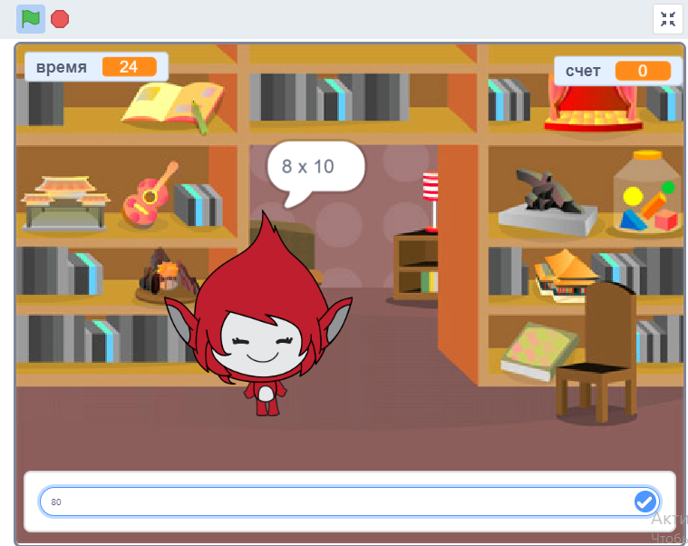

## Введение

В этом проекте вы узнаете, как создать викторину таблицы времени, в которой вы должны получить столько ответов, сколько сможете за 30 секунд.

  <iframe allowtransparency="true" width="485" height="402" src="https://scratch.mit.edu/projects/embed/42225768/?autostart=false" frameborder="0"></iframe>
  

### Дополнительная информация для лидеров клуба

Если вам нужно распечатать этот проект, воспользуйтесь [Версия для печати](https://projects.raspberrypi.org/en/projects/brain-game/print).

## \--- коллапс \---

## название: заметки лидера клуба

## Введение:

В этом проекте дети узнают, как сделать игру с викториной таблицы времени, в которой игрок должен ответить на столько вопросов правильно, как может за 30 секунд.

## Ресурсы

Для этого проекта необходимо использовать Scratch 2. Царапина 2 может быть использована онлайн по адресу [jumpto.cc/scratch-on](http://jumpto.cc/scratch-on) или может быть загружена с [jumpto.cc/scratch-off](http://jumpto.cc/scratch-off) и использована в автономном режиме.

Вы можете найти завершенную версию этого проекта [онлайн](http://scratch.mit.edu/projects/42225768/#editor), или его можно загрузить, щелкнув ссылку «Материалы проекта» для этого проекта, которая содержит:

* BrainGame.sb2

## Цели обучения

* Этот проект объединяет изучение ранее приобретенных навыков программирования и показывает, как широковещательные передачи могут использоваться для создания простой системы меню игры.

Этот проект охватывает элементы из следующих направлений: [Малина Pi Digital Making Curriculum](http://rpf.io/curriculum):

* [Объедините конструкции программирования для решения проблемы.](https://www.raspberrypi.org/curriculum/programming/builder)

## проблемы

* «Изменение костюмов» - изменение характера игрового персонажа в ответ на правильные и неправильные ответы;
* «Добавление оценки» - добавление точки для ответа на каждый правильный вопрос;
* «Начальный экран» - изменение фона сцены в ответ на `стартов`{: class = "blockevents"} и `end`{: class = "blockevents"} широковещательные сообщения, создание 2 игровых экранов;
* «Улучшенная анимация» - использование петель и эффектов для улучшения правильной / неправильной графической анимации;
* «Звук и музыка» - консолидация обучения музыкальных петель и звуковых эффектов;
* «Гонка до 10 очков» - изменение игровой логики для создания новой игровой цели;
* «Экран инструкций» - консолидация использования трансляций для создания игрового меню, добавив новую кнопку «инструкции» и экран.

\--- / свернуть \---

## \--- коллапс \---

## название: материалы проекта

## Ресурсы лидера клуба

* [Загруженный завершенный проект Scratch 2](resources/BrainGame.sb2)
* [Онлайн-проект Scratch 2](http://scratch.mit.edu/projects/42225768/#editor)

\--- / свернуть \---