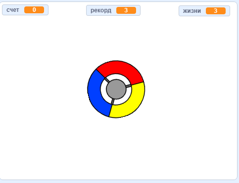

## Что дальше?

Попробуй проект [Поймай точки](https://projects.raspberrypi.org/ru-RU/projects/catch-the-dots?utm_source=pathway&utm_medium=whatnext&utm_campaign=projects), в котором ты создашь игру на реакцию! В этом проекте ты узнаешь, как создавать клоны спрайтов и как использовать переменную для постепенного ускорения игры.

--- no-print ---

Используй клавиши со стрелками, чтобы вращать колесо контроллера и ловить летающие точки, пока они летят к центру. Если ты пропустишь три точки, игра заканчивается.

  <iframe allowtransparency="true" width="485" height="402" src="https://scratch.mit.edu/projects/embed/252923761/?autostart=false" frameborder="0" scrolling="no"></iframe>
  

--- /no-print ---

--- print-only ---

--- /print-only ---

***
Этот проект был переведен волонтерами:

Мария Гапоник

Максим Рябцев

Благодаря волонтерам мы можем дать возможность людям во всем мире учиться на их родном языке. Вы можете помочь нам привлечь больше волонтёров-переводчиков - подробнее на [rpf.io/translate](https://rpf.io/translate).