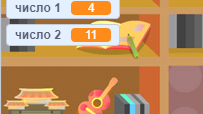

## Создание вопросов

Начнем с создания случайных вопросов для игрока.

+ Начните новый проект Scratch и удалите кошачий спрайт, чтобы ваш проект пуст. Вы можете найти онлайн-редактор Scratch по адресу <a href="http://jumpto.cc/scratch-new" target="_blank">jumpto.cc/scratch-new</a>.

+ Выберите персонажа и фона для вашей игры. Вы можете выбрать любой понравившийся! Вот пример:
    
    

+ Создайте 2 новые переменные, которые называются `number 1`{: class = "blockdata"} и `number 2`{: class = "blockdata"}. Эти переменные будут хранить 2 числа, которые будут умножены вместе.
    
    

+ Добавьте код в свой символ, чтобы установить обе эти переменные в `случайных`{: class = "blockoperators"} число от 2 до 12.
    
    ```blocks
        при нажатии флага
        установите [номер 1 v] на (выберите случайное (2) - (12))
        установите [число 2 v] на (выберите случайное (2) - (12))
    ```

+ Затем вы можете попросить игрока ответить и сообщить им, были ли они правильными или неправильными.
    
    ```blocks
        при выборе флага
        установите [число 1 v] на (выберите случайное (2) - (12))
        установите [число 2 v] на (выберите случайное (2) - (12))
        ask (join (номер 1) присоедините [x] (номер 2))) и подождите
        если <(ответ) = ((номер 1) * (номер 2))> затем
            скажите [да! :)] for (2) secs
        else
            say [nope :(] для (2) secs
        end
    ```

+ Полностью проверьте свой проект, правильно ответив на один вопрос, а другой - на неправильный ответ.

+ Добавьте `forever`{: class = "blockcontrol"} вокруг этого кода, так что игроку задают много вопросов.

+ Создайте таймер обратного отсчета на сцене, используя переменную с именем `time`{: class = "blockdata"}. Проект «Ghostbusters» имеет инструкции для создания таймера (на шаге 5), если вам нужна помощь!

+ Проверьте свой проект еще раз - вы должны быть в состоянии продолжать задавать вопросы, пока не закончится время.