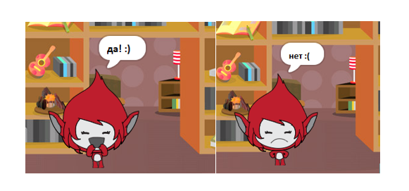

## Задача: добавь счёт и реакции

Можешь ли ты добавить счет в игру?

Ты можешь добавить код так, чтобы игрок получал очки за каждый правильный ответ. Если ты строгий, то даже можешь добавить такой код, который сбрасывает счёт игрока до нуля, в случае неправильного ответа!

[[[generic-scratch3-high-score]]]

Можешь ли ты сделать так, чтобы персонаж реагировал на ответ игрока и менял костюм, если ответ правильный или неправильный?

