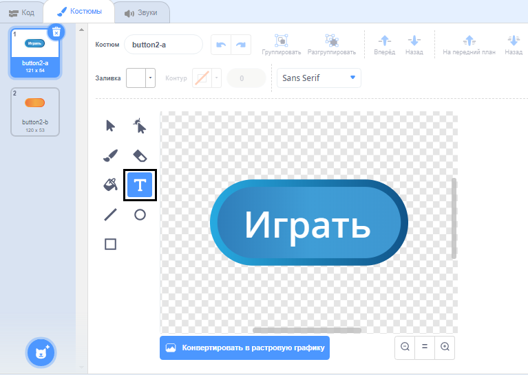
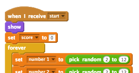
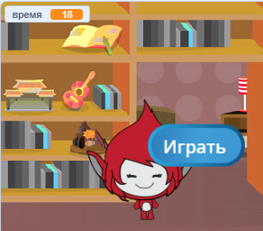
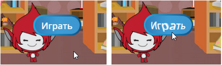

## Несколько игр

Давайте добавим в игру кнопку «играть», чтобы вы могли играть много раз.

+ Создайте новую кнопку справки «Играть», которую ваш игрок нажмет, чтобы начать новую игру. Вы можете сделать это самостоятельно или отредактировать спрайт из библиотеки Scratch.
    
    

+ Добавьте этот код в свою новую кнопку.
    
    ```blocks
        когда флаг щелкнул
        показать
    
        когда этот спрайт нажал
        скрыть
        трансляции [начать v]
    ```
    
    Этот код показывает кнопку воспроизведения при запуске вашего проекта. Когда кнопка нажата, она скрыта, а затем передает сообщение, которое запустит игру.

+ Вам нужно будет отредактировать код своего персонажа, чтобы игра начиналась, когда они получали сообщение `start`{: class = "blockevents"}, а не при щелчке по флагу.
    
    Замените `когда флаг щелкнул`{: class = "blockevents"} код с `когда я получаю start`{: class = "blockevents"}.
    
    

+ Нажмите зеленый флаг, а затем нажмите кнопку нового воспроизведения, чтобы проверить его. Вы должны увидеть, что игра не запускается до тех пор, пока не будет нажата кнопка.

+ Вы заметили, что таймер запускается при нажатии на зеленый флаг, а не при запуске игры?
    
    
    
    Вы можете решить эту проблему?

+ Нажмите на сцене, и замените `остановить все`{: класс = «blockcontrol»} блок с `конца`{: класс = «blockevents»} сообщения.
    
    

+ Теперь вы можете добавить код в свою кнопку, чтобы показать его снова в конце каждой игры.
    
    ```blocks
        когда я получаю [end v]
        show
    ```

+ Вам также необходимо остановить своего персонажа, задающего вопросы в конце каждой игры:
    
    ```blocks
        когда я получаю [end v]
        stop [другие скрипты в спрайте v]
    ```

+ Проверьте свою игру, сыграв пару игр. Вы должны заметить, что кнопка воспроизведения отображается после каждой игры. Чтобы облегчить тестирование, вы можете сократить каждую игру, чтобы она длилась всего несколько секунд.
    
    ```blocks
        установить [время v] на [10]
    ```

+ Вы можете даже изменить, как выглядит кнопка, когда мышь нависает над ней.
    
    ```blocks
        когда флаг щелкнул
        показ
        навсегда
        если <touching [mouse-pointer v]?> затем
            установить [fisheye v] effect to (30)
        else
            set [fisheye v] effect to (0)
        end
        end
    ```
    
    