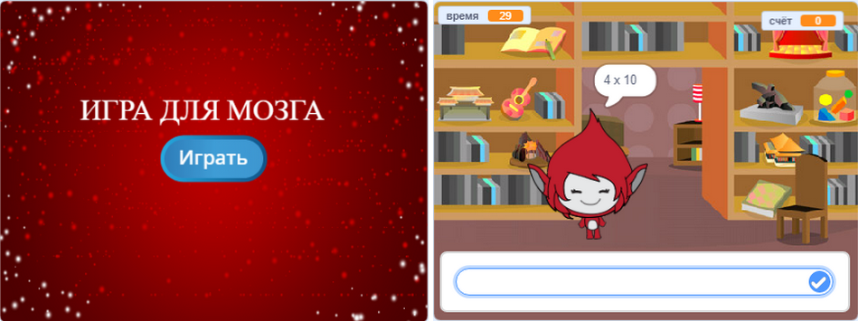

\--- вызов \---

## Задача: начальный экран

Можете ли вы добавить еще один фон для своей сцены, который станет началом экрана вашей игры? Вы можете использовать `когда я получаю start`{: class = "blockevents"} и `когда я получаю блокировку`{: class = "blockevents"} для переключения между фонами.

Вы также можете показывать и скрывать свой персонаж, а также показывать и скрывать свой таймер, используя эти блоки:

```blocks
показать переменную [время v]
```

```blocks
скрыть переменную [время v]
```



\--- /вызов \---