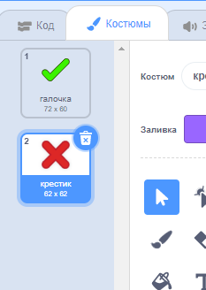
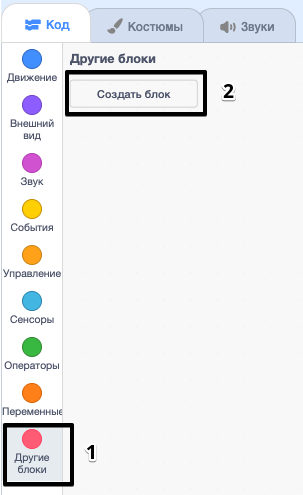

## Добавление графики

Вместо того, чтобы ваш персонаж просто сказал `да! :)` или `нет :(` игроку, давайте добавим некоторые графики, которые позволят игроку узнать, как они это делают.

+ Создайте новый спрайт под названием «Результат», содержащий как «тик», так и «крест».
    
    

+ Измените код своего персонажа, чтобы вместо того, чтобы сообщать игроку, как они это сделали, он передает `правильных`{: class = "blockevents"} и `неправильных`{: class = "blockevents"} сообщения вместо этого.
    
    

+ Теперь вы можете использовать эти сообщения, чтобы показать костюм «тик» или «крест». Добавьте этот код в свой новый спрайт «Результат»:
    
    

+ Проверьте свою игру снова. Вы должны видеть тик, когда вы получите правильный вопрос, и крест, когда вы ошибаетесь!
    
    

+ Вы заметили, что код для `когда я получаю правильные`{: class = "blockevents"} и `когда я получаю неправильные`{: class = "blockevents"}, почти идентичен? Давайте создадим функцию, которая упростит вам внесение изменений в ваш код.
    
    На спрайте «Результат» нажмите `Больше блоков`{: class = "blockmoreblocks"}, а затем «Сделать блок». Создайте новую функцию под названием `animate`{: class = "blockmoreblocks"}.
    
    

+ Затем вы можете добавить код анимации в свою новую функцию анимации, а затем просто используйте эту функцию дважды:
    
    

+ Теперь, если вы хотите показать тик и крест в течение более длительного или более короткого времени, вам нужно всего лишь внести одно изменение в свой код. Попробуй!

+ Вместо того, чтобы просто показывать и скрывать тик и крест, вы можете изменить свою анимационную функцию, чтобы графика затухала.
    
    ```blocks
        define [animate]
        set [ghost v] effect to (100)
        show
        repeat (25)
            change [ghost v] effect by (-4)
        end
        hide
    ```