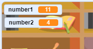

## Vytvorte otázky

Začnete tým, že vytvoríte náhodné otázky, ktoré musí hráč odpovedať.

\--- úloha \---

Otvorte nový projekt Scratch.

**Online:** open a new online Scratch project at [rpf.io/scratch-new](http://rpf.io/scratch-new){:target="_blank"}.

**Offline:** otvorte nový projekt v režime offline.

Ak potrebujete stiahnuť a nainštalovať editor Scratch offline, môžete ho nájsť na adrese [rpf.io/scratchoff](http://rpf.io/scratchoff){: target = "_ blank"}.

\--- / úloha \---

\--- task \---

Add a character sprite and a backdrop for your game. You can choose any you like! Here's an example:


\--- /task \---

\--- task \---

Make sure you have your character sprite selected. Create two new variables, called `number 1`{:class="block3variables"} and `number 2`{:class="block3variables"}, to store the numbers for the quiz questions.




[[[generic-scratch3-add-variable]]]

\--- / úloha \---

\--- task \---

Add code to your character sprite to set both of the `variables`{:class="block3variables"} to a `random`{:class="block3operators"} number between 2 and 12.


```blocks3
keď príznak kliknutí
sadu [číslo 1] pre (vybrať náhodné (2) až (12)),
sada [číslo 2] pre (vyberať náhodne (2) až (12))
```

\--- /task \---

\--- task \---

Add code to `ask`{:class="block3sensing"} the player for the answer, and then `say for 2 seconds`{:class="block3looks"} whether the answer was right or wrong:


```blocks3
keď príznak kliknutí
sadu [číslo 1] pre (vybrať náhodné (2) až (12)),
sada [číslo 2] pre (vyberať náhodne (2) až (12))

+ požiadať (pripojiť (číslo 1) (spojiť [x] (číslo 2))) a čakať
+ ak <(odpoveď) = (číslo 1) * (číslo 2)> a
+ :)] za (2) sekundy
+ iný
+ povedať [no :(] za (2) sekundy
+ koniec
```

\--- /task \---

\--- task \---

Test your project twice: answer one question correctly, and the other incorrectly.

\--- /task \---

\--- task \---

Add a `forever`{:class="block3control"} loop around this code, so that the game asks the player lots of questions in a row.

\--- hints \---

\--- hint \---

You need to add a `forever`{:class="block3control"} block, and put all of the code except the `when flag clicked`{:class="block3control"} block into it.

\--- /hint \---

\--- hint \---

Here is the block you need:

```blocks3
navždy
koniec
```

\--- /hint \---

\--- hint \---

Here is what your code should look like:

```blocks3
keď príznak kliknutí

+ navždy
    sada [číslo 1] pre (vybrať náhodné (2) až (12))
    sady [číslo 2] pre (vybrať náhodné (2) až (12)),
    požiadať (pripojiť (číslo 1) (spojiť [x] (číslo 2))) a čakajte
    ak <(odpoveď) = ((číslo 1) * (číslo 2))> potom
        povedzte [yes! :)] za (2) sekundy
    inak
        povedať [no :(] za (2) sekundy
    koniec
koniec
```

\--- /hint \---

\--- /hints \---

\--- /task \---