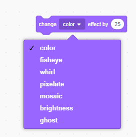

## Pridajte grafiku

V súčasnej dobe postava sprite hovorí `áno! :)` alebo `no :(` odpovede hráča. Pridajte nejakú grafiku a nechajte prehrávač vedieť, či je jeho odpoveď správna alebo nesprávna.

\--- úloha \---

Vytvorte nový skript nazývaný "Výsledok" a zverte ho "krížikom" a "krížovým" kostýmom.


\--- / úloha \---

\--- úloha \---

Zmeňte kód vášho znakového sprite tak, že namiesto toho, aby niečo povedal hráčovi, `vysiela`{: class = "block3events"} správy "správne" alebo "zlé".


```blocks3
ak <(odpoveď) = ((číslo 1) * (číslo 2))> potom

- povedzte [yes! :)] pre (2) sekúnd,
+ vysielanie (správny objem)
iný
- povedzme [Nie :(] pre (2) sekúnd,
+ vysielanie (zle v)
koniec
```

\--- / úloha \---

\--- úloha \---

Teraz môžete použiť tieto správy na `zobraziť`{: class = "block3looks"} "kliešť" alebo "cross" kostým. Pridajte nasledujúci kód do výsledku Sprite:


```blocks3
    keď dostanem [správne v]
    prepínač kostým na (začiarknite v)
    zobraziť
    čakať (1) sekundy
    skryť

    keď dostanem [nesprávne v]
    kostým prepnúť na (kríž v)
    zobraziť
    čakať (1) sekúnd
    skryť

    keď sa vlajka klikne
    skryť
```

\--- / úloha \---

\--- task \--- Otestuj svoju hru znovu. Tie by ste mali vidieť, kedykoľvek odpoviete na otázku správne a krížik vždy, keď odpoviete nesprávne!


\--- / úloha \---

Vidíte, že kód pre `keď dostanem správne`{: class = "block3events"} a `keď dostanem nesprávne`{: class = "block3events"} je takmer totožný?

Takže môžete ľahšie zmeniť svoj kód, vytvoríte vlastný blok.

\--- úloha \---

Vyberte sprite "Výsledok". Potom kliknite na `My Blocks`{: class = "block3myblocks"} a potom na **Make a Block**. Vytvorte nový blok a zavolajte ho `animovať`{: class = "block3myblocks"}.


\--- / úloha \---

\--- úloha \--- Presuňte kód na `zobrazenie`{: class = "block3looks"} a `skryť`{: class = "block3looks"} Sprite do výsledku `animate`{: class = block3myblocks "} blok:


```blocks3
definovať animovať
zobraziť
čakať (1) sekundy
skryť
```

\--- / úloha \---

\--- úloha \--- Uistite sa, že ste odstránili `zobrazenie`{: class = "block3looks"} a `skryť`{: class = "block3looks"} bloky pod **obidvoch** zo `kostýmu spínača`{ class = "block3looks"} bloky.

Potom pridajte `Animovať`{: class = "block3myblocks"} blok pod obaja z `spínače kostýmu`{: class = "block3looks"} bloky. Váš kód by mal teraz vyzerať takto:


```blocks3
    keď dostanem [správne v]
    kostým prepnúť na (zaškrtnite v)
    animate :: vlastné

    keď dostanem [nesprávne v]
    prepnúť kostým na (kríž v)
    animate :: vlastné
```

\--- / úloha \---

Kvôli vlastnému bloku `animate`{: class = "block3myblocks"}, stačí len urobiť jednu zmenu v kóde, ak chcete zobraziť kostýmy Sprite 'Result' dlhšie alebo kratšie.

\--- úloha \---

Zmeňte svoj kód tak, aby sa na 2 sekundy zobrazili kostýmy "zaškrtnite" alebo "kríž".

\--- / úloha \---

\--- úloha \--- Miesto `ukazuje`{: class = "block3looks"} a `skrýva`{: class = "block3looks"} len 'kliešť' alebo 'priečne' kostýmov, môžete zmeniť `Animovať`{: class = "block3myblocks"} zablokovať, aby sa kostýmy vytratili.


```blocks3
    definovať animovať
    nastaviť [ghost v] efekt na (100)
    zobraziť
    opakovať (25)
        zmeniť [ghost v] efekt podľa (-4)
    koniec
    skryť
```

\--- / úloha \---

Môžete zlepšiť animáciu grafiky 'tick' alebo 'cross'? Môžete pridať kód, aby sa kostýmy vybledli rovnako, alebo môžete použiť iné cool efekty:

