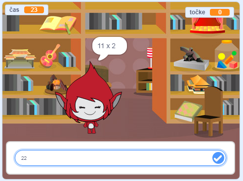

\--- no-print \---

To je **Scratch 3** različica projekta. Obstaja tudi [Scratch 2](https://projects.raspberrypi.org/en/projects/brain-game-scratch2) različica projekta.

\--- /no-print \---

## Uvod

V tem projektu boš ustvaril matematični kviz, v katerem ima igralec 30 sekund, da poda čim več pravilnih odgovorov.

### Kaj boš ustvaril?

\--- no-print \--- Klikni gumb za začetek. Vnesi odgovor na vprašanje in pritisni tipko <kbd>Enter</kbd>.

  <iframe allowtransparency="true" width="485" height="402" src="https://scratch.mit.edu/projects/embed/250234955/?autostart=false" frameborder="0" scrolling="no"></iframe>
  

\--- /no-print \---

\--- print-only \---  \--- /print-only \---

## \--- collapse \---

## title: Kaj se boš naučil?

+ Kako v Scratchu objavljati sporočila
+ Kako v Scratchu ustvariti in uporabljati lastne bloke

\--- /collapse \---

## \--- collapse \---

## title: Kaj boš potreboval?

### Strojna oprema

+ Računalnik, ki lahko poganja Scratch 3

### Programska oprema

+ Scratch 3 (bodisi [na spletu](http://rpf.io/scratchon) {:target = "_blank"} ali [brez povezave](http://rpf.io/scratchoff){:target = "_blank"})

\--- /collapse \---

## \--- collapse \---

## title: Dodatne informacije za izobraževalce

\--- Če želite natisniti ta projekt, uporabite [tiskalniku prijazno različico](https://projects.raspberrypi.org/en/projects/brain-game/print)

Zaključen projekt lahko najdete [tukaj](http://rpf.io/p/en/brain-game-get)"}{:target="_blank"}.

\--- /collapse \---