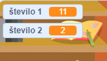

## Ustvari vprašanja

Začel boš z ustvarjanjem naključnih vprašanj, na katera mora igralec odgovoriti.

\--- task \---

Ustvari nov Scratch projekt.

**S povezavo:** odpri nov spletni Scratch projekt na [rpf.io/scratch-new](http://rpf.io/scratch-new){:target="_blank"}.

**Brez povezave:** odprite nov projekt v namiznem Scratch urejevalniku.

Če želiš prenesti in namestiti Namizni Scratch, ga lahko najdeš na [rpf.io/scratchoff](http://rpf.io/scratchoff){: target = "_ blank"}.

\--- /task \---

\--- task \--- Dodaj figuro lika in ozadje a svojo igro. Lahko izbereš poljubno! Tukaj je primer:


\--- /task \---

\--- task \--- Prepričaj se, da imaš izbrano figuro lika. Ustvari dve novi spremenljivki in jih poimenuj `število 1`{:class="block3variables"} in `število 2`{:class="block3variables"}. Namenjeni sta shranjevanju številk za vprašanja kviza.

 

[[[generic-scratch3-add-variable]]]

\--- /task \---

\--- task \--- Figuri lika dodaj kodo, ki nastavi vrednost obeh `spremenljivk`{:class="block3variables"} na `naključno`{:class="block3operators"} število med 2 in 12.


```blocks3
ko kliknemo na zastavico
nastavi [število 1 v] na (naključno število (2) in (12))
nastavi [število 2 v] na (naključno število (2) in (12))
```

\--- /task \---

\--- task \--- Dodaj kodo, ki `vpraša`{:class="block3sensing"} igralca za odgovor, in potem `reci za 2 sekundi`{:class="block3looks"} ali je odgovor pravilen ali ne:


```blocks3
ko kliknemo na zastavico
nastavi [število 1 v] na (naključno število (2) in (12))
nastavi [število 2 v] na (naključno število (2) in (12))

+ vprašaj (združi(število1)(združi[ x ] (število 2))) in počakaj
+ če <(odgovor) = ((število 1)*(število 2))> potem
+ reci [da! :)] za (2) sekund
+ sicer
+ reci [ne :(] za (2) sekund
+ konec
```

\--- /task \---

\--- task \---

Dvakrat preizkusi svoj projekt: na eno vprašanje odgovori pravilno, na drugega napačno.

\--- /task \---

\--- task \---

Dodaj `ponavljaj`{:class="block3control"} zanko okoli te kode, zato da igra postavi igralcu veliko vprašanj.

\--- hints \--- \--- hint \---

Dodati moraš `ponavljaj`{:class="block3control"} blok, in vanj prestaviti vse, razen bloka `ko kliknemo na zastavico`{:class="block3control"}.

\--- /hint \--- \--- hint \--- Here is the block you need:

```blocks3
ponavljaj
konec
```

\--- /hint \--- \--- hint \--- Tvoja koda bi morala izgledati tako:

```blocks3
ko kliknemo na zastavico

+ ponavljaj
  nastavi [število 1 v] na (naključno število (2) in (12))
  nastavi [število 2 v] na (naključno število (2) in (12))
  vprašaj (združi(število1)(združi[ x ] (število 2))) in počakaj
  če <(odgovor) = ((število 1)*(število 2))> potem
    reci [da! :)] za (2) sekund
  sicer
    reci [ne :(] za (2) sekund
konec
```

\--- /hint \--- \--- /hints \---

\--- /task \---