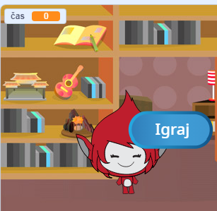
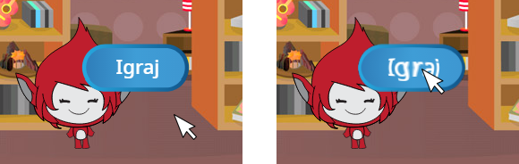

## Več iger

Zdaj boš dodal gum 'Igraj', da bo lahko igralec igro ponovil večkrat.

\--- task \--- Ustvari novo figuro za gumb 'Igraj', ki jo bo igralec moral klikniti, da začne novo igro.

Figuro lahko narišeš sam ali urediš figuro iz knjižnice.


\--- /task \---

\--- task \--- Figuri gumba dodaj to kodo:


```blocks3
    ko kliknemo na zastavico
  pokaži

  ko kliknemo to figuro
  skrij
  objavi (začni v)
```

\--- /task \---

Nova koda vsebuje blok `objavi`{:class="block3events"}, ki pošlje sporočilo 'začni'.

Nova koda poskrbi, da se figura gumba 'Igraj' prikaže, ko igralec klikne na zastavico. Ko igralec klikne na figuro gumba, se figura skrije in potem objavi sporočilo za druge figure, na katero se lahko te odzovejo.

Trenutno figura lika začne spraševati vprašanja po tem, ko igralec klikne na zastavico. Spremeni kodo svoje igre tako, da bo figura začela spraševati po tem, ko prejme `objavo`{:class="block3events"}. 'začni'.

\--- task \--- Izberi figuro lika in v njegovem razdelku so kodo zamenjaj blok `ko klinemo na zastavico`{:class="block3events"} z blokom `ko prejmem začni`.


```blocks3
<br />- ko kliknemo na zastavico
+ ko prejmem [začni v]
nastavi [število 1 v] na (naključno število (2) in (12))
nastavi [število 2 v] na (naključno število (2) in (12))
vprašaj (združi(število1)(združi[ x ] (število 2))) in počakaj
če <(odgovor) = ((število 1)*(število 2))> potem
  reci [da! :)] za (2) sekund
sicer
  reci [ne :(] za (2) sekund
konec
```

\--- /task \---

\--- task \---

Klikni na zeleno zastavico in nato klikni na gumb Igraj, da vidiš, če zadeva deluje. Opazil boš, da se igra ne začne, preden ne klikneš na gumb.

\--- /task \---

Si opazil, da se čas začne odštevati, ko je kliknjena zelena zastavica in ne tedaj, ko se igra začne?



\--- task \---

Ali lahko spremeniš kodo časovnika, da se bo čas začel odštevati, ko igralec klikne na gumb?

\--- /task \---

\--- task \--- Figuri gumba dodaj kodo, ki bo poskrbela, da se bo spet prikazal ob koncu igre.


```blocks3
    ko prejmem [konec v]
  pokaži
```

\--- /task \---

\--- task \---

Preizkusi gumb 'Igraj', tako da igro nekajkrat odigraš. Gumb bi se moral prikazati ob koncu vsake igre.

Da bi igro hitreje preizkusil, lahko spremeniš vrednost spremenljivke `čas`{:class="block3variables"}, tako da je vsaka igra dolga le nekaj sekund.


```blocks3
    nastavi [čas v] na [10]
```

\--- /task \---

Lahko spremeniš videz gumba, kadar je kazalec miške nad njim.


```blocks3
    ko kliknemo na zastavico
    pokaži
    ponavljaj
    če &ltse dotika (kazlca miške v)?&gt potem
        nastavi učinek [ribje oko v] na (30)
    sicer
        nastavi učinek [ribje oko v] na (0)
    konec
    konec
```

 \--- /task \---