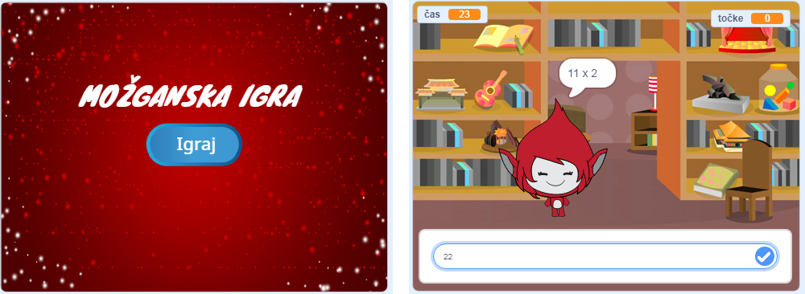

## Izziv: ustvari začetni zaslon

Ali lahko dodaš še eno ozadje, ki bo začetni zaslon tvoje igre?

Lahko uporabiš `ko prejmem začni`{:class="block3events"} in `ko prejmem konec`{:class="block3events"} bloka, da preklapljaš med ozadji.

Za prikazovanje ali skrivanje lika, medtem ko tvoja igra zamenja ozadje, lahko uporabiš bloka `pokaži`{:class="block3looks"} in `skrij`{:class="block3looks"}.

Da bi prikazal ali skril čas in rezultat, kadar tvoja igra preklaplja med ozadji, lahko uporabiš bloka `pokaži spremenljivko`{:class="block3variables"} in `skrij spremenljvko`{:class="block3variables"}.

