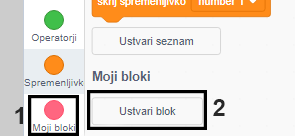

## Dodaj grafiko

Trenutno figura lika na odgovor igralca reče zgolj `da! :)` ali `ne :(`. Dodaj nekaj grafike, da bo igralec vedel ali je odgovor pravilen ali ne.

\--- task \---

Ustvari novo figuro z imenom 'Rezultat' in ji dodaj videz 'kljukice' in 'križca'.


\--- /task \---

\--- task \---

Spremeni kodo figure lika na tak način, da bo namesto tega, da nekaj reče, `objavil` {:class="block3events"} sporočilo 'pravilno' ali 'narobe'.


```blocks3
če <(odgovor) = ((število 1)*(število 2))> potem

- reci [da! :)] za (2) sekund
+ objavi (pravilno v)
sicer
- reci [ne :(] za (2) sekund
+ objavi (narobe v)
konec
```

\--- /task \---

\--- task \---

Ta sporočila lahko sedaj uporabiš, da `pokažeš`{:class="block3looks"} videza 'kljukica' ali 'križec'. Dodaj sledečo kodo figuri 'Rezultat':


```blocks3
    ko prejmem [pravilno v]
  zamenjaj videz na (kljukica v)
  pokaži
  počakaj (1) sekund
  skrij

ko prejmem [narobe v]
  zamenjaj videz na (križec v)
  pokaži
  počakaj (1) sekund
  skrij

ko kliknemo na zastavico
  skrij
```

\--- /task \---

\--- task \---

Test your game again. You should see the tick whenever you answer a question correctly, and the cross whenever you answer incorrectly!


\--- /task \---

Can you see that the code for `when I receive correct`{:class="block3events"} and `when I receive wrong`{:class="block3events"} is nearly identical?

So you can change your code more easily, you are going to create a custom block.

\--- task \---

Select the 'Result' sprite. Then click on `My Blocks`{:class="block3myblocks"}, and then on **Make a Block**. Create a new block and call it `animate`{:class="block3myblocks"}.




\--- /task \---

\--- task \---

Move the code to `show`{:class="block3looks"} and `hide`{:class="block3looks"} the 'Result' sprite into the `animate`{:class="block3myblocks"} block:


```blocks3
definiraj animiraj
pokaži
počakaj (1) sekund
skrij
```

\--- /task \---

\--- task \---

Make sure you have removed the `show`{:class="block3looks"} and `hide`{:class="block3looks"} blocks below **both** of the `switch costume`{:class="block3looks"} blocks.

Then add the `animate`{:class="block3myblocks"} block below both of the `switch costume`{:class="block3looks"} blocks. Your code should now look like this:


```blocks3
    ko prejmem [pravilno v]
  zamenjaj videz na (kljukica v)
  animiraj:: custom

ko prejmem [narobe v]
  zamenjaj videz na (križec v)
  animiraj:: custom
```

\--- /task \---

Because of the custom `animate`{:class="block3myblocks"} block, you now only need to make one change to your code if you want to show the 'Result' sprite's costumes a longer or shorter time.

\--- task \---

Change your code so that the 'tick' or 'cross' costumes display for 2 seconds.

\--- /task \---

\--- task \---

Instead of `showing`{:class="block3looks"} and `hiding`{:class="block3looks"} the 'tick' or 'cross' costumes, you could change your `animate`{:class="block3myblocks"} block so that the costumes fade in.


```blocks3
    definiraj animiraj
  nastavi učinek [duh v] na (100)
  pokaži
  ponovi (25) krat
    spremni učinek [duh] za (-4)
  konec
  skrij
```

\--- /task \---

Can you improve the animation of the 'tick' or 'cross' graphics? You could add code to make the costumes fade out as well, or you could use other cool effects:

