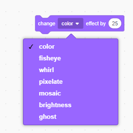

## Lägg till grafik

För tillfället säger teckenspiralen bara `ja! :)` eller `nej :(` till spelarens svar. Lägg till lite grafik för att låta spelaren veta om deras svar är korrekt eller felaktigt.

\--- uppgift \---

Skapa en ny sprite som heter "Resultat", och ge den en "tick / check" och en "cross" -dräkt.


\--- / uppgift \---

\--- uppgift \---

Ändra din bokstavs kod så att istället för att säga något till spelaren sänder ``{: class = "block3events"} meddelandena "korrekta" eller "fel".


```blocks3
om <(svar) = ((nummer 1) * (nummer 2))> då

- säg [ja! :)] för (2) sekunder
+ sändning (korrekt v)
annat
- säg [nope :(] för (2) sekunder
+ sändning (fel v)
slutet
```

\--- / uppgift \---

\--- uppgift \---

Nu kan du använda dessa meddelanden till `visa`{: class = "block3looks"} "tick" eller "cross" kostym. Lägg till följande kod till "Resultat" sprite:


```blocks3
    när jag tar emot [korrekt v]
    byt kostym till (kryssa v)
    visa
    vänta (1) sekunder
    dölja

    när jag tar emot [fel v]
    byta kostym till (korsa v)
    visa
    vänta (1) sekunder
    göm

    när flaggan klickade
    gömma
```

\--- / uppgift \---

\--- Uppgift \--- Testa ditt spel igen. Du bör se fältet när du svarar på en fråga korrekt, och korset när du svarar felaktigt!


\--- / uppgift \---

Kan du se att koden för `när jag får rätt`{: class = "block3events"} och `när jag får fel`{: class = "block3events"} är nästan identisk?

Så du kan enkelt ändra din kod, du kommer att skapa ett eget block.

\--- uppgift \---

Välj "Resultat" sprite. Klicka sedan på `Mina block`{: class = "block3myblocks"} och sedan på **Gör ett block**. Skapa ett nytt block och kalla det `animera`{: class = "block3myblocks"}.


\--- / uppgift \---

\--- uppgift \--- Flytta koden till `visa`{: class = "block3looks"} och `gömma`{: class = "block3looks"} "Resultat" sprite i `animera`{: class = " block3myblocks "} block:


```blocks3
definiera animera
visa
vänta (1) sekunder
gömma
```

\--- / uppgift \---

\--- uppgift \--- Se till att du har tagit bort `visa`{: class = "block3looks"} och `gömma`{: class = "block3looks"} block under **båda** av `switchdräkten`{: class = "block3looks"} block.

Lägg sedan till `animera`{: class = "block3myblocks"} -blocket under båda `switchkostymen`{: class = "block3looks"} -blocken. Din kod ska nu se ut så här:


```blocks3
    när jag tar emot [korrekt v]
    byta kostym till (tick v)
    animera :: anpassad

    när jag tar emot [fel v]
    byta kostym till (cross v)
    animera :: anpassade
```

\--- / uppgift \---

På grund av den anpassade `animera`{: class = "block3myblocks"} -blocket behöver du bara göra en ändring till din kod om du vill visa resultatresultatets kostymer en längre eller kortare tid.

\--- uppgift \---

Ändra din kod så att "tick" eller "cross" -dräkterna visas i 2 sekunder.

\--- / uppgift \---

\--- uppgift \--- stället för att `visar`{: class = "block3looks"} och `gömmer sig`{: class = "block3looks"} "tick" eller "cross" -dräkterna kan du ändra din `animera`{: class = "block3myblocks"} blockera så att kostymerna dyker in.


```blocks3
    definiera animera
    set [ghost v] effekt till (100)
    visa
    upprepa (25)
        ändra [spöke v] effekt av (-4)

    göm
```

\--- / uppgift \---

Kan du förbättra animeringen av "tick" eller "cross" -grafik? Du kan lägga till kod för att få kostymerna att blekna ut, eller du kan använda andra coola effekter:

