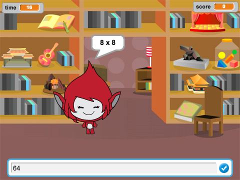

## Вступ

У цьому проекті ви дізнаєтеся як створити вікторину з відліком часу, у якій потрібно дати якнайбільше правильних відповідей за 30 секунд.

  <iframe allowtransparency="true" width="485" height="402" src="https://scratch.mit.edu/projects/embed/42225768/?autostart=false" frameborder="0"></iframe>
  

### Додаткова інформація для керівників гуртка

Якщо Вам потрібно роздрукувати цей проект, будь ласка, скористайтеся [версією для друку](https://projects.raspberrypi.org/en/projects/brain-game/print).

## \--- collapse \---

## title: Нотатки керівника гуртка

## Вступ:

У цьому проекті діти навчаться створювати гру-вікторину з відліком часу, у якій гравець повинен дати якомога більше правильних відповідей за 30 секунд.

## Ресурси

Для цього проекту слід використовувати Scratch 2. Scratch 2 можна використовувати онлайн [jumpto.cc/scratch-on](http://jumpto.cc/scratch-on) або завантажити [jumpto.cc/scratch-off](http://jumpto.cc/scratch-off) і використовувати офлайн.

Повну версію цього проекту ви можете знайти [онлайн](http://scratch.mit.edu/projects/42225768/#editor) або завантажити за посиланням "Матеріали проекту":

* РозвиваючаГра.sb2

## Мета навчання

* Цей проект закріплює вивчення попередніх навичок програмування та показує, як трансляції можуть використовуватись для створення простої системи меню гри.

Цей проект охоплює елементи з наступних напрямків навчального плану [ Raspberry Pi Digital Making Curriculum](http://rpf.io/curriculum):

* [Для вирішення проблеми об'єднайте конструкції програмування.](https://www.raspberrypi.org/curriculum/programming/builder)

## Завдання

* "Зміна одягу" - зміна зовнішнього вигляду персонажа гри, що залежить від правильності чи неправильності відповідей;
* "Збільшення рахунку" - за кожну правильну відповідь на питання додається бал;
* "Початковий екран" - зміна фону сцени у відповідь на `початок`{:class="blockevents"} і `кінець`{:class="blockevents"} передачі повідомлень при створенні 2 ігрових 'екранів';
* "Вдосконалена анімація" - використання циклів та ефектів для покращення правильної/неправильної графічної анімації;
* "Звук та музика" - закріплення вивчення музичних циклів та звукових ефектів;
* "Перегони до 10 балів" - зміна ігрової логіки для створення нової мети гри;
* "Вікно з інструкцією" - закріплення використання трансляцій для створення меню гри шляхом додавання нової кнопки 'інструкції' та екрану.

\--- /collapse \---

## \--- collapse \---

## title: Матеріали проекту

## Ресурси керівника гуртка

* [Повний проект Scratch 2 для завантаження](resources/BrainGame.sb2)
* [Повний проект Scratch 2 онлайн](http://scratch.mit.edu/projects/42225768/#editor)

\--- /collapse \---