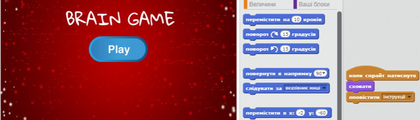

\--- challenge \---

## Завдання: Екран з інструкцією

Can you add an instructions screen to your game, telling your player how to play the game? You'll need an 'Instructions' button, and another stage background.



You may also need a 'Back' button to take you to the main menu.

```blocks
    broadcast [main menu v]
```

\--- /challenge \---