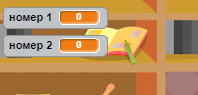

## Створення запитань

Розпочнемо зі створення випадкових запитань для гравців.

+ Почніть новий проект у Scratch і видаліть з нього спрайт кота. Ознайомитись із Scratch editor можна за посиланням <a href="http://jumpto.cc/scratch-new" target="_blank">jumpto.cc/scratch-new</a>.

+ Оберіть об'єкт і тло гри. Ви можете обрати що завгодно! Ось приклад:
    
    

+ Створіть 2 нові змінні `Число 1`{:class="blockdata"} і `Число 2`{:class="blockdata"}. Ці змінні збережуть 2 числа, що будуть перемножуватись.
    
    

+ Додайте код до вашого об'єкта, надавши змінним значення ` випадкове число`{:class="blockoperators"} від 2 до 12.
    
    ```blocks
        коли натиснуто ⚑    надати [number 1 v] значення (випадкове від (2) до (12))
        надати [number 2 v] значення (випадкове від (2) до (12)).
    ```

+ Тоді ви можете попросити гравця дати відповідь і повідомити його чи вона була правильною.
    
    ```blocks
        коли натиснуто ⚑
    надати [number 1 v] значення (випадкове від (2) до (12))
    надати [number 2 v] значення (випадкове від (2) до (12))
    запитати (з'єднати (number 1) (з'єднати [ x ] (number 2))) і чекати
    якщо <(answer) = ((number 1) * (number 2))>; то 
      говорити [yes! :\)\] for (2) secs
    else
    говорити [nope :(] (2) сек
    end
    ```

+ Перевірте свій проект повною мірою: на одне питання дайте правильну відповідь, а на інше - неправильну.

+ Додайте команду `завжди`{:class="blockcontrol"} біля цього коду, щоб гравець мав багато запитань.

+ Використовуючи змінну `час`{:class="blockdata"} створіть таймер зворотнього відліку. Якщо вам потрібна допомога, у проекті "Мисливці за привидами" є інструкції зі створення таймера (крок 5)!

+ Перевірте свій проект знову - необхідно, щоб ви могли відповідати на запитання доки не закінчиться час.