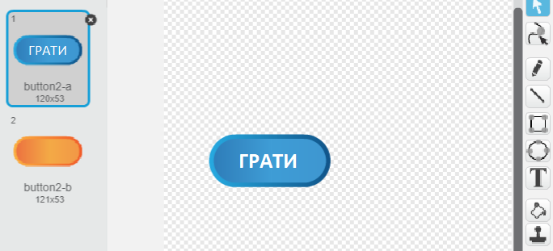
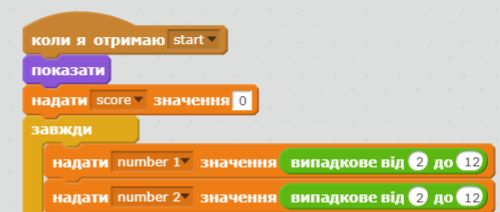
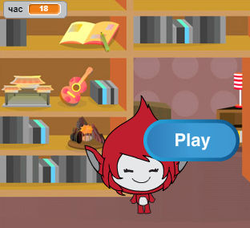
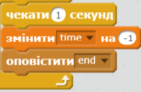
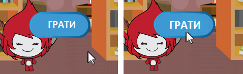

## Multiple games

Додамо кнопку "Грати", щоб можна було відкрити гру багато разів.

+ Створіть спрайт нової кнопки "Грати", за допомогою якої гравець починатиме нову гру. Ви можете намалювати її або відредагувати спрайт із бібліотеки Scratch.
    
    

+ Додайте цей код до нової кнопки.
    
    ```blocks
        коли натиснуто ⚑
    показати
    
    коли спрайт натиснуто
    сховати
    оповістити [start v]
    ```
    
    This code shows the play button when your project is started. When the button is clicked, it is hidden and then broadcasts a message that will start the game.

+ You'll need to edit your character's code, so that the game starts when they receive the `start`{:class="blockevents"} message, and not when the flag is clicked.
    
    Замініть код `коли натиснуто ⚑`{:class="blockevents"} на `коли я отримаю `{:class="blockevents"} start.
    
    

+ Click the green flag and then click your new play button to test it. You should see that the game doesn't start until the button is clicked.

+ Did you notice that the timer starts when the green flag is clicked, and not when the game starts?
    
    
    
    Can you fix this problem?

+ Натисніть на сцену і замініть блок `зупинити все`{:class="blockcontrol"} на `зупинити цей скрипт`{:class="blockevents"}.
    
    

+ You can now add code to your button, to show it again at the end of each game.
    
    ```blocks
        when I receive [end v]
        show
    ```

+ You'll also need to stop your character asking questions at the end of each game:
    
    ```blocks
        коли я отримаю [end v]
        зупинити [інші скрипти цього спрайту v]
    ```

+ Test your play button by playing a couple of games. You should notice that the play button shows after each game. To make testing easier, you can shorten each game, so that it only lasts a few seconds.
    
    ```blocks
        надати [година v] значення [10]
    ```

+ You can even change how the button looks when the mouse hovers over it.
    
    ```blocks
        коли натиснуто ⚑
        показати
        завжди 
        якщо <touching [mouse-pointer v]?> то 
        встановити ефект [вздуття v] в (30)
      
        встановити ефект [вздуття v] в (0)
        end
        end
    ```
    
    