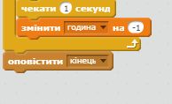

## Multiple games

Додамо кнопку "Грати", щоб можна було відкрити гру багато разів.

+ Створіть спрайт нової кнопки "Грати", за допомогою якої гравець починатиме нову гру. Ви можете намалювати її або відредагувати спрайт із бібліотеки Scratch.
    
    

+ Додайте цей код до нової кнопки.
    
    ```blocks
        коли натиснуто ⚑
    показати
    
    коли спрайт натиснуто
    сховати
    оповістити [start v]
    ```
    
    За допомогою цього коду кнопка відтворення з'являється, коли починається проект. При натисканні на кнопку код приховується і транслюється повідомлення, що запускає гру.

+ Потрібно відредагувати код об'єктів так, щоб гра запускалась, коли вони отримають повідомлення про `старт`, а не коли ви натиснули на прапорець.
    
    Замініть код `коли натиснуто ⚑`{:class="blockevents"} на `коли я отримаю `{:class="blockevents"} повідомлення про старт.
    
    

+ Натисніть на зелений прапорець і на нову кнопку відтворення, щоб перевірити її. Слід переконатись, що гра не починається, доки ви не натиснули на кнопку.

+ Ви помітили, що таймер запускається коли натискаєте на зелений прапорець, а не коли починається гра?
    
    
    
    Чи можна вирішити цю проблему?

+ Натисніть на сцену і замініть блок `зупинити все`{:class="blockcontrol"} на `зупинити цей скрипт`{:class="blockevents"}.
    
    

+ Зараз ви можете додати код до кнопки, щоб вона з'являлась знову наприкінці кожної гри.
    
    ```blocks
        when I receive [end v]
        show
    ```

+ Також наприкінці кожної гри потрібно зробити так, щоб об'єкт припинив ставити запитання:
    
    ```blocks
        коли я отримаю [end v]
        зупинити [інші скрипти цього спрайту v]
    ```

+ Test your play button by playing a couple of games. You should notice that the play button shows after each game. To make testing easier, you can shorten each game, so that it only lasts a few seconds.
    
    ```blocks
        надати [година v] значення [10]
    ```

+ Можна навіть змінити вигляд кнопки, навівши на неї курсор мишки.
    
    ```blocks
        коли натиснуто ⚑
        показати
        завжди 
        якщо <touching [mouse-pointer v]?> то 
        встановити ефект [вздуття v] в (30)
      
        встановити ефект [вздуття v] в (0)
        end
        end
    ```
    
    