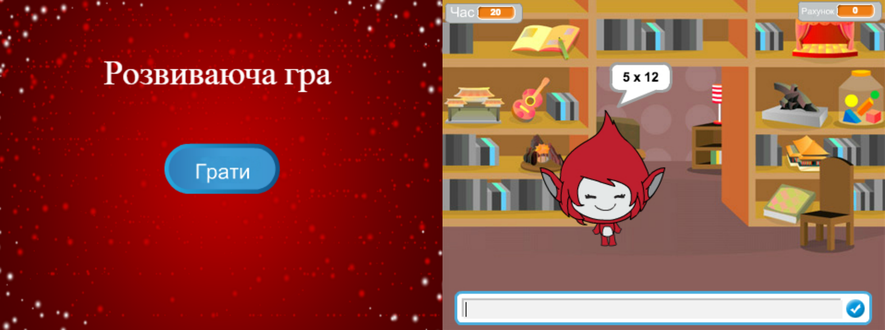

\--- challenge \---

## Завдання: Початковий екран

Чи можете ви додати нове тло до сцени, яке стане початковим екраном вашої гри? Щоб переключатись між тлами, можна використовувати блоки `коли я отримаю початок`{:class="blockevents"} і `коли я отримаю кінець`{:class="blockevents"}.

Використовуючи ці блоки ви зможете показати і приховати змінні і навіть приховати таймер:

```blocks
показати змінну [година v]
```

```blocks
сховати змінну [година v]
```



\--- /challenge \---