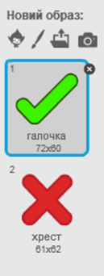
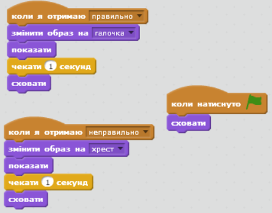
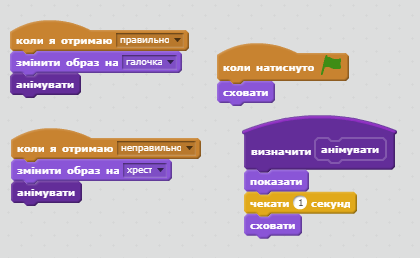

## Додавання графіки

Щоб об'єкт говорив не тільки `так!:)` або `ні:(`, додамо графіку, що дозволить гравцеві дізнатись свої результати.

+ Створіть новий спрайт із назвою "Результат", що включатиме образ галочки і хрестика.
    
    

+ Змініть код об'єкта так, щоб замість "так" або "ні" транслювались повідомлення `правильно`{:class="blockevents"} і `неправильно`{:class="blockevents"}.
    
    

+ Ці повідомлення тепер можна використовувати, щоб з'являвся образ галочки чи хрестика. Додайте цей код до нового спрайту "Результат":
    
    

+ Перевірте гру знову. Кожного разу, коли ви відповідаєте правильно має з'являтись галочка, а коли неправильно - хрестик!
    
    

+ Помітили, що код `коли я отримаю правильно`{:class="blockevents"} і `коли я отримаю неправильно`{:class="blockevents"} майже однаковий? Let's create a function to make it easier for you to make changes to your code.
    
    On your 'Result' sprite, click `More Blocks`{:class="blockmoreblocks"}, and then 'Make a Block'. Create a new function called `animate`{:class="blockmoreblocks"}.
    
    

+ You can then add the animation code into your new animation function, and then just use the function twice:
    
    

+ Now, if you want to show the tick and the cross for a longer or shorter time, you only need to make one change to your code. Try it!

+ Instead of just showing and hiding the tick and the cross, you could change your animation function, so that the graphics fade in.
    
    ```blocks
        визначити [animate]
        встановити ефект [привид v] в (100)
        показати
        повторити (25) 
              змінити ефект [привид v] на (-4)
        end
        сховати
    ```