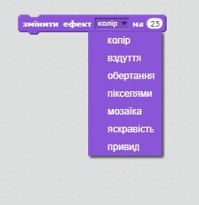

\--- challenge \---

## Завдання: Удосконалення анімації

Чи можна удосконалити анімацію графічних ефектів? Ви можете запрограмувати галочку і хрестик так, щоб вони з'являлись чи зникали поступово або можна використати інші класні ефекти:

\--- /challenge \---