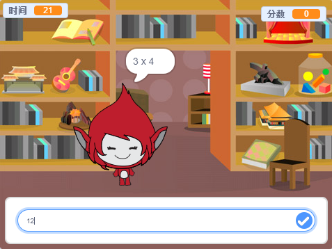

--- no-print ---

此项目基于**Scratch 3**版本，另有一基于[Scratch 2版本](https://projects.raspberrypi.org/zh-CN/projects/brain-game-scratch2)的项目。

--- /no-print ---

## 介绍

在这个项目中，你将会创建一个数字测验游戏。玩家需要在30秒的时间内，尽可能的回答对更多题目。

### 你将制作

--- no-print ---

点击按钮开始。输入答案，然后按下<kbd>回车</kbd>键

  <iframe allowtransparency="true" width="485" height="402" src="https://scratch.mit.edu/projects/embed/411973908/?autostart=false" frameborder="0" scrolling="no"></iframe>
  

--- /no-print ---

--- print-only ---

--- /print-only ---

--- collapse ---
---
title: 您将学到
---

+ 如何在Scratch中使用广播
+ 如何创建和使用自定义的Scratch积木

--- /collapse ---

--- collapse ---
---
title: 你需要准备
---

### 硬件

+ 一台能够运行Scratch 3的计算机

### 软件

+ Scratch 3 ([在线版本](https://rpf.io/scratchon){:target="_blank"}或[离线版本](https://rpf.io/scratchoff){:target="_blank"}）

--- /collapse ---

--- collapse ---
---
title: 教师附加说明
---

--- no-print ---

如果您需要打印本项目文件，请使用[合适的打印版本](https://projects.raspberrypi.org/zh-CN/projects/brain-game/print)

--- /no-print ---

你可以在这里找到[完整项目](https://rpf.io/p/zh-CN/brain-game-get){:target="_blank"}。

--- /collapse ---