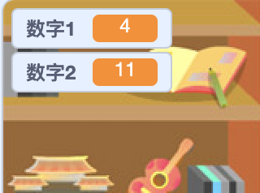

## 创建问题

首先，你需要创建随机问题，玩家必须回答这些问题。

--- task ---

打开一个新的Scratch项目

**在线：**在[rpf.io/scrath-new](http://rpf.io/scratch-new){:target="_blank"}中打开一个新的Scratch在线项目 。

**离线：**在离线编辑器中打开一个新项目。

如果您需要下载并安装Scratch离线编辑器，可以在[rpf.io/scratchoff](http://rpf.io/scratchoff){:target="_blank"}中获取。

--- /task ---

--- task ---

为您的游戏添加精灵角色和背景。你可以选择任何你喜欢的！比如：


--- /task ---

--- task ---

确保您已选中角色精灵。 创建两个新变量，命名为`数字1`{:class="block3variables"}和`数字2`{:class="block3variables"}，用于存储测验题目的数字。




[[[generic-scratch3-add-variable]]]

--- /task ---

--- task ---

为您的角色精灵添加代码以设置两个`变量`{:class="block3variables"}为2到12之间的`随机`{:class="block3operators"}数字。


```blocks3
当 ⚑ 被点击
将 [数字1 v] 设为 (在 (2) 和 (12) 之间取随机数)
将 [数字2 v] 设为 (在 (2) 和 (12) 之间取随机数)
```

--- /task ---

--- task ---

添加`提问`{:class="block3sensing"} 代码以向玩家询问答案，无论回答正确还是错误，都`说2秒钟`{:class="block3looks"}。


```blocks3
when flag clicked
set [数字1 v] to (pick random (2) to (12))
set [数字2 v] to (pick random (2) to (12))
+ ask (join (数字1)(join [ x ] (数字2))) and wait
+ if <(answer) = ((数字1)*(数字2))> then
+ say [对! :)] for (2) seconds
+ else
+ say [不对 :(] for (2) seconds
+ end
```

--- /task ---

--- task ---

测试你的项目两次：正确回答一个问次题，错误回答另一次问题。

--- /task ---

--- task ---

对这段代码添加一个`重复执行`{:class="block3control"}循环，这样游戏就会连续询问玩家更多问题。

--- hints ---


--- hint ---

你需要添加一个`重复执行`{:class="block3control"}积木，然后把除了`当 ⚑ 被点击`{:class="block3control"}模块的其它所有模块都放入其中。

--- /hint ---

--- hint ---

以下是你需要的积木：

```blocks3
重复执行
end
```

--- /hint ---

--- hint ---

您的代码看起来应该是这样的：

```blocks3
当 ⚑ 被点击
+ 重复执行
    将 [数字1 v] 设为 (在 (2) 和 (12) 之间取随机数)
    将 [数字2 v] 设为 (在 (2) 和 (12) 之间取随机数)
    询问 (连接 (数字1) 和 (连接 [ x ] 和 (数字2))) 并等待
    如果 <(回答) = ((数字1)*(数字2))> 那么
        说 [对! :)] (2) 秒
    否则
        说 [不对 :(] (2) 秒
    end
end
```

--- /hint ---

--- /hints ---

--- /task ---