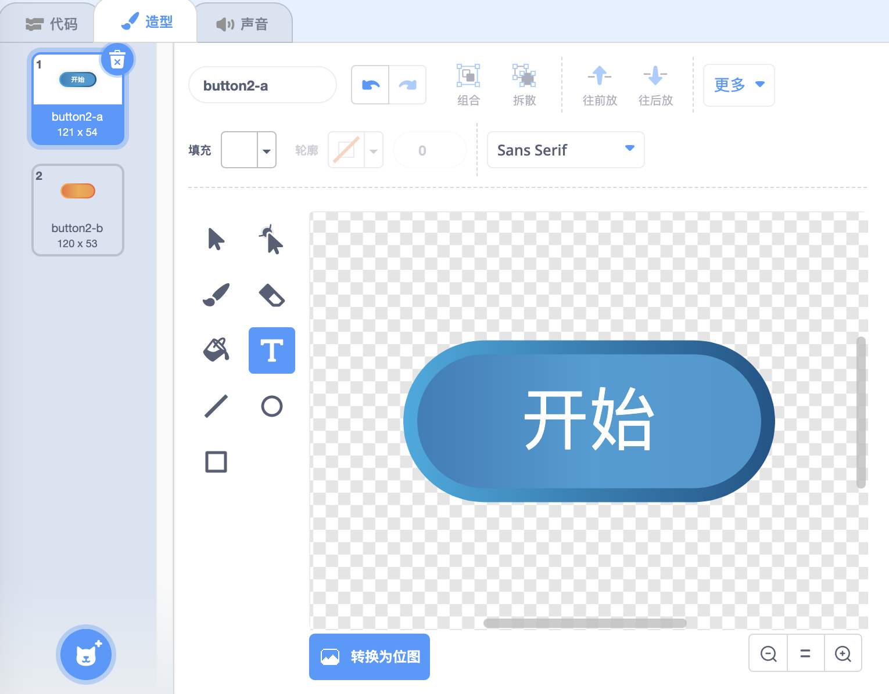
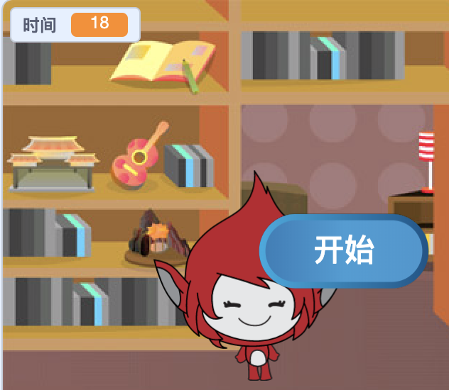
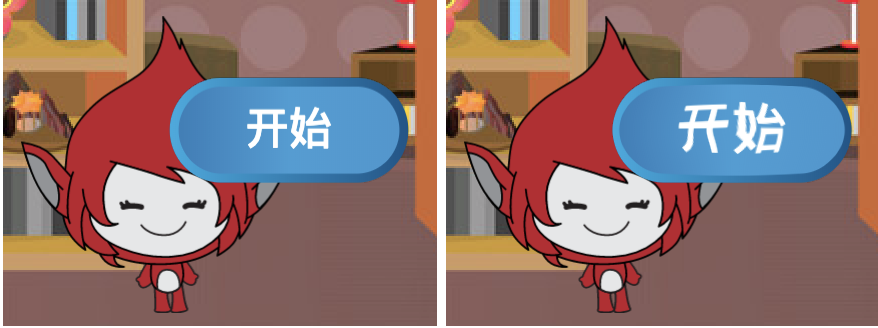

## 重复游戏

现在，您将添加一个“开始”按钮，以便玩家可以玩多次游戏。

\--- task \---

Create a new 'Play' button sprite that the player needs to click to start a new game.

You can draw the sprite yourself, or edit a sprite from the library.



\--- /task \---

\--- task \---

Add this code to your button sprite:


```blocks3
    当 ⚑ 被点击
    显示

    当角色被点击
    隐藏
    广播(开始 v)
```

\--- /task \---

The new code includes another `broadcast`{:class="block3events"} block, which sends the message 'start'.

The new code makes the 'Play' button sprite show when when player clicks on the flag. When the player clicks on the button sprite, the sprite hides and then broadcasts a message that other sprites can react to.

At the moment, the character sprite starts asking questions when the player clicks the flag. Change your game's code so that character sprite starts asking questions when it receives the 'start' `broadcast`{:class="block3events"}.

\--- task \---

Select your character sprite and, in its code section, replace the `when flag clicked`{:class="block3events"} block with a `when I receive start`{:class="block3events"} block.


```blocks3
<br />- 当 ⚑ 被点击
+ 当接收到 [开始 v]
将 [数字1 v] 设为 (在 (2) to (12) 之间取随机数)
将 [数字2 v] 设为 (在 (2) to (12) 之间取随机数)
询问 (连接 (数字1)(连接 [ x ] (数字2))) 并等待
如果 <(回答) = ((数字1)*(数字2))> 那么
    说 [对! :)] (2) 秒
否则
    说 [不对 :(] (2) 秒
end
```

\--- /task \---

\--- task \---

Click the green flag, and then click on the new 'Play' button to test whether it works. You should see that the game doesn't start before you click on the button.

\--- /task \---

Can you see that the timer starts when the green flag is clicked, instead of when the game starts?



\--- task \---

Can you change the code for the timer so that the timer starts when the player clicks on the button?

\--- /task \---

\--- task \---

Add code to your button sprite so that the button shows again at the end of each game.


```blocks3
    当接收到 [结束 v]
    显示
```

\--- /task \---

\--- task \---

Test the 'Play' button by playing a couple of games. The button should show at the end of each game.

To test the game more quickly, you can change the value of `time`{:class="block3variables"} so that each game is only a few seconds long.


```blocks3
    将 [时间 v] 设为 [10]
```

\--- /task \---

\--- task \---

You can change how the button looks when the mouse pointer hovers over it.


```blocks3
    当 ⚑ 被点击
显示
重复执行 
  如果 <touching (mouse-pointer v)?> 那么 
    将 [鱼眼 v] 特效设定为 (30)
  否则 
    将 [鱼眼 v] 特效设定为 (0)
  end
end
```



\--- /task \---